# 第一章 Nginx 简介

## 1.1 Nginx 概述

**Nginx (\"engine x\") 是一个高性能的 HTTP 和反向代理服务器**,**特点是占有内存少，并发能力强**，事实上 nginx 的并发能力确实在同类型的网页服务器中表现较好，中国大陆使用 nginx 网站用户有：百度、京东、新浪、网易、腾讯、淘宝等

## 1.2 Nginx 作为 web 服务器

Nginx 可以作为静态页面的 web 服务器，同时还支持 CGI 协议的动态语言，比如 perl、php等。但是不支持 java。Java 程序只能通过与 tomcat 配合完成。Nginx 专为性能优化而开发，性能是其最重要的考量,实现上非常注重效率 ，能经受高负载的考验,**有报告表明能支持高达 50,000 个并发连接数。**

> [[https://lnmp.org/nginx.html]{.ul}](https://lnmp.org/nginx.html)

## **1.3 正向代理**

> Nginx 不仅可以做反向代理，实现负载均衡。还能用作正向代理来进行上网等功能。
>
> 正向代理：如果把局域网外的 Internet 想象成一个巨大的资源库，则局域网中的客户端要访

问 Internet，则需要通过代理服务器来访问，这种代理服务就称为正向代理。


## **1.4 反向代理**

反向代理，其实客户端对代理是无感知的，因为客户端不需要任何配置就可以访问，我们只需要将请求发送到反向代理服务器，由反向代理服务器去选择目标服务器获取数据后，在返回给客户端，此时反向代理服务器和目标服务器对外就是一个服务器，暴露的是代理服务器地址，隐藏了真实服务器 IP 地址。


## **1.5 负载均衡**

客户端发送多个请求到服务器，服务器处理请求，有一些可能要与数据库进行交互，服务器处理完毕后，再将结果返回给客户端。


这种架构模式对于早期的系统相对单一，并发请求相对较少的情况下是比较适合的，成本也低。

但是随着信息数量的不断增长，访问量和数据量的飞速增长，以及系统业务的复杂度增加，这种架构会造成服务器相应客户端的请求日益缓慢，并发量特别大的时候，还容易造成服务器直接崩溃。很明显这是由于服务器性能的瓶颈造成的问题，那么如何解决这种情况呢？

我们首先想到的可能是升级服务器的配置，比如提高 CPU 执行频率，加大内存等提高机器的物理性能来解决此问题，但是我们知道[[摩尔定律]{.ul}](https://www.cnblogs.com/ysocean/p/7641540.html)的日益失效，硬件的性能提升已经不能满足日益提升的需求了。最明显的一个例子，天猫双十一当天，某个热销商品的瞬时访问量是极其庞大的，那么类似上面的系统架构，将机器都增加到现有的顶级物理配置，都是不能够满足需求的。那么怎么办呢？

上面的分析我们去掉了增加服务器物理配置来解决问题的办法，也就是说纵向解决问题的办法行不通了，那么横向增加服务器的数量呢？这时候集群的概念产生了，单个服务器解决不了，我们**增加服务器的数量，然后将请求分发到各个服务器上，将原先请求集中到单个服务器上的情况改为将请求分发到多个服务器上，将负载分发到不同的服务器**，也就是我们所说的**负载均衡(服务器集群)**

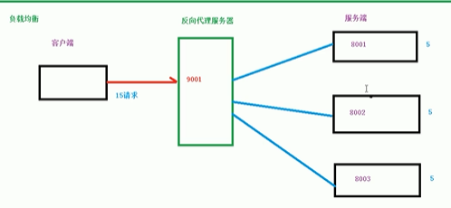

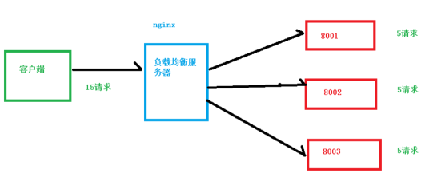

## **1.6 动静分离**

为了加快网站的解析速度，可以把动态页面和静态页面由不同的服务器来解析，加快解析速度。降低原来单个服务器的压力。

原始访问方式：


缺点：给tomcat带来更大的压力，解决办法为采用动静分离。

使用代理服务器动静分离后：

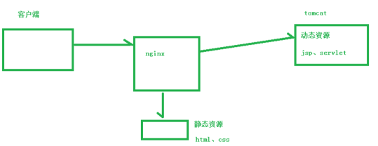


# 第二章 Nginx 安装

## 2.1 进入 nginx 官网，下载

[[http://nginx.org/]{.ul}](http://nginx.org/)

需要前置依赖:


## 2.2 安装nginx

方式一：分步骤安装依赖

**第一步，安装 pcre**

```
wget http://downloads.sourceforge.net/project/pcre/pcre/8.37/pcre-8.37.tar.gz 
```

解压文件，进入解压之后的目录，执行

```
./configure
```


命令完成后，回到 pcre 目录下执行 make命令（把该文件编译并安装）

```
make && make install
```

最后通过检查版本号判断是否安装成功。

```
pcre-config \--version
```

**第二步，安装 openssl**

**第三步，安装 zlib**

方式二：使用yum命令整体安装依赖(同时完成编译和安装)

```
yum -y install make zlib zlib-devel gcc-c++ libtool openssl openssl-devel
```


**第四步，安装 nginx**

1、把nginx按文件放到linux系统中

2、解压缩 nginx-xx.tar.gz 包

3、进入解压缩目录，执行./configure

4、使用 make && make install编译并安装

下载：

```
wget http://nginx.org/download/nginx-1.10.3.tar.gz
```

解压：

```
tar -zxvf nginx-1.10.3.tar.gz cd nginx-1.10.3
```

配置：

```
./configure
```

编译并安装：

```
make && make install
```

./configure是源代码安装的第一步,主要的作用是对即将安装的软件进行配置,检查当前的环境是否满足要安装软件的依赖关系,但并不是所有的tar包都是源代码的包,

## 2.3 防火墙

在linux中由于防火墙的存在，需要针对端口进行处理。

**开启防火墙**

```
systemctl start firewalld
```

**停止防火墙**

```
systemctl stop firewalld
```

**查看防火墙状态**

```
systemctl status firewalld
```

**查看开放的端口号**

```
firewall-cmd \--list-all
```

**设置开放的端口号**

```
firewall-cmd \--add-service=http \--permanent
```

```
sudo firewall-cmd \--add-port=80/tcp \--permanent
```

**重启防火墙**

```
firewall-cmd \--reload
```


# 第 3 章 nginx 常用的命令和配置文件

## 3.1 nginx 常用的命令

使用nginx命令必须进入nginx目录下。

1.  启动命令

在/usr/local/nginx/sbin 目录下执行

```
./nginx
```

2.  关闭命令

在/usr/local/nginx/sbin 目录下执行

```
./nginx -s stop
```

3.  重新加载命令（在nginx开启情况下 重新加载文件）

在/usr/local/nginx/sbin 目录下执行

```
./nginx -s reload
```

4.  查看版本号

```
./nginx -v
```

## 3.2 nginx.conf 配置文件

nginx 安装目录下，其默认的配置文件都放在这个目录的 conf 目录下，而主配置文件 nginx.conf 也在其中，后续对 nginx 的使用基本上都是对此配置文件进行相应的修改。

配置文件中有很多\#， 开头的表示注释内容，我们去掉所有以 \# 开头的段落，精简之后的内容如下：

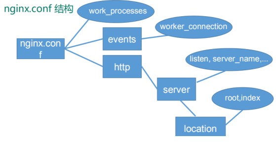

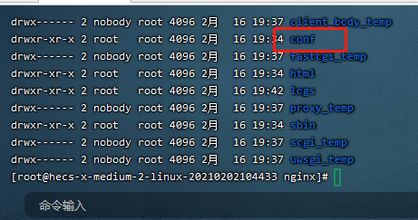

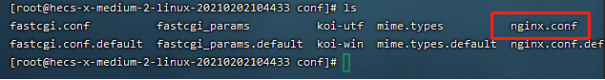


```

#user  nobody;
worker_processes  1;

#error_log  logs/error.log;
#error_log  logs/error.log  notice;
#error_log  logs/error.log  info;

#pid        logs/nginx.pid;


events {
    worker_connections  1024;
}
http {
    include       mime.types;
    default_type  application/octet-stream;

    #log_format  main  '$remote_addr - $remote_user [$time_local] "$request" '
    #                  '$status $body_bytes_sent "$http_referer" '
    #                  '"$http_user_agent" "$http_x_forwarded_for"';

    #access_log  logs/access.log  main;

    sendfile        on;
    #tcp_nopush     on;
    #keepalive_timeout  0;
    keepalive_timeout  65;
    #gzip  on;
    server {
        listen       80;
        server_name  localhost;

        #charset koi8-r;

        #access_log  logs/host.access.log  main;

        location / {
            root   html;
            index  index.html index.htm;
        }

        #error_page  404              /404.html;

        # redirect server error pages to the static page /50x.html
        #
        error_page   500 502 503 504  /50x.html;
        location = /50x.html {
            root   html;
        }

        # proxy the PHP scripts to Apache listening on 127.0.0.1:80
        #
        #location ~ \.php$ {
        #    proxy_pass   http://127.0.0.1;
        #}

        # pass the PHP scripts to FastCGI server listening on 127.0.0.1:9000
        #
        #location ~ \.php$ {
        #    root           html;
        #    fastcgi_pass   127.0.0.1:9000;
        #    fastcgi_index  index.php;
        #    fastcgi_param  SCRIPT_FILENAME  /scripts$fastcgi_script_name;
        #    include        fastcgi_params;
        #}

        # deny access to .htaccess files, if Apache's document root
        # concurs with nginx's one
        #
        #location ~ /\.ht {
        #    deny  all;
        #}
    }


    # another virtual host using mix of IP-, name-, and port-based configuration
    #
    #server {
    #    listen       8000;
    #    listen       somename:8080;
    #    server_name  somename  alias  another.alias;

    #    location / {
    #        root   html;
    #        index  index.html index.htm;
    #    }
    #}


    # HTTPS server
    #
    #server {
    #    listen       443 ssl;
    #    server_name  localhost;

    #    ssl_certificate      cert.pem;
    #    ssl_certificate_key  cert.key;

    #    ssl_session_cache    shared:SSL:1m;
    #    ssl_session_timeout  5m;

    #    ssl_ciphers  HIGH:!aNULL:!MD5;
    #    ssl_prefer_server_ciphers  on;

    #    location / {
    #        root   html;
    #        index  index.html index.htm;
    #    }
    #}
}


```

**根据上述文件，我们可以很明显的将 nginx.conf 配置文件分为三部分：**

**第一部分：全局块**

从配置文件开始到 events 块之间的内容，主要会设置一些影响 nginx 服务器整体运行的配置指令，主要包括配置运行 Nginx 服务器的用户（组）、允许生成的 worker process 数，进程 PID 存放路径、日志存放路径和类型以及配置文件的引入等。

比如上面第一行配置的：


这是 Nginx 服务器并发处理服务的关键配置，worker_processes 值越大，可以支持的并发处理量也越多，但是会受到硬件、软件等设备的制约。

**第二部分：events 块**

比如上面的配置：


events 块涉及的指令主要影响 Nginx 服务器与用户的网络连接，常用的设置包括是否开启对多 work process 下的网络连接进行序列化，是否允许同时接收多个网络连接，选取哪种事件驱动模型来处理连接请求，每个 word process 可以同时支持的最大连接数等。

上述例子就表示每个 work process 支持的最大连接数为 1024. 这部分的配置对 Nginx 的性能影响较大，在实际中应该灵活配置

**第三部分：http 块**

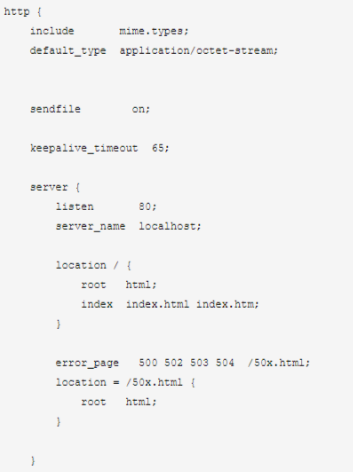

这算是 Nginx 服务器配置中最频繁的部分，代理、缓存和日志定义等绝大多数功能和第三方模块的配置都在这里。

需要注意的是：http 块也可以包括 **http 全局块**、**server 块**。

①、http 全局块

http 全局块配置的指令包括文件引入、MIME-TYPE 定义、日志自定义、连接超时时间、单链接请求数上限等。

②、server 块

这块和虚拟主机有密切关系，虚拟主机从用户角度看，和一个的硬件主机是完全一样的，该技术的产生是为了节省互联网服务器硬件成本。

每个 http 块可以包括多个 server 块，而每个 server 块就相当于一个虚拟主机。

而每个 server 块也分为全局 server 块，以及可以同时包含多个 locaton 块

**1、全局 server 块**

最常见的配置是本虚拟机主机的监听配置和本虚拟主机的名称或 IP 配置。

**2、location 块**

一个 server 块可以配置多个 location 块。

这块的主要作用是基于 Nginx 服务器接收到的请求字符串（例如 server_name/uri-string），对虚拟主机名称（也可以是 IP 别名）之外的字符串（例如 前面的 /uri-string）进行匹配，对特定的请求进行处理。地址定向、数据缓存和应答控制等功能，还有许多第三方模块的配置也在这里进行。

# 第 4 章 nginx 配置实例-反向代理

## 4.1反向代理实例前提

### java jdk安装

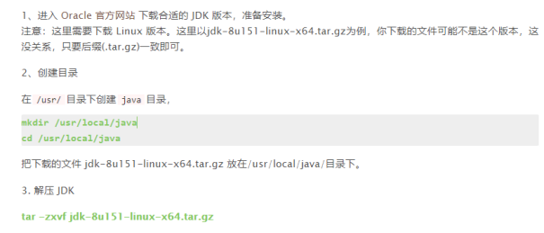


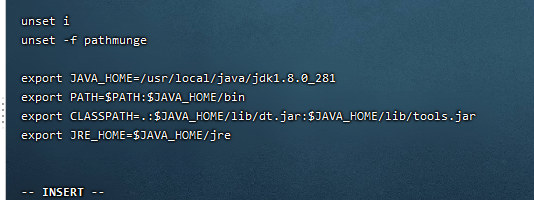

```
export JAVA_HOME=/usr/local/java/jdk1.8.0_281

export PATH=\$PATH:\$JAVA_HOME/bin

export CLASSPATH=.:\$JAVA_HOME/lib/dt.jar:\$JAVA_HOME/lib/tools.jar

export JRE_HOME=\$JAVA_HOME/jre
```

注意：其中 JAVA_HOME， JRE_HOME 请根据自己的实际安装路径及 JDK 版本配置。

修改/etc/profile之后让其生效

```
. /etc/profile 
```

（注意 . 之后应有一个空格）


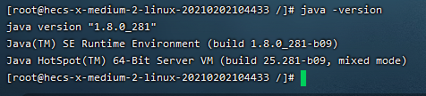

### tomcat安装

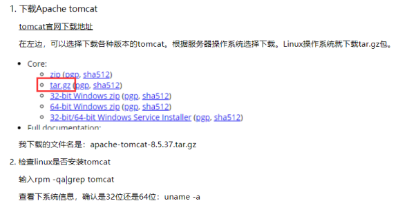

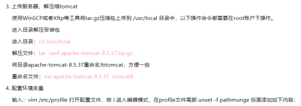

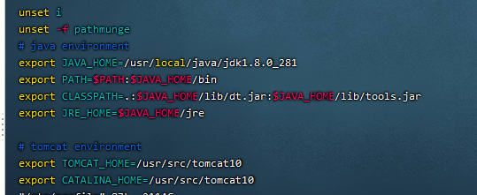

参考链接：https://www.cnblogs.com/li150dan/p/12535067.html

## 4.2反向代理实例一

实现效果：使用 nginx 反向代理，访问 www.123.com 直接跳转到 127.0.0.1:8080


### linux服务器同时运行两个或多个tomcat

参考链接：[[linux服务器同时运行两个或多个tomcat]{.ul}](https://www.cnblogs.com/weibanggang/p/11460665.html)

## 4.3反向代理实验代码

1.  启动一个 tomcat，使用curl指令请求,出现代码返回成功

```
curl 127.0.0.1:8080
```

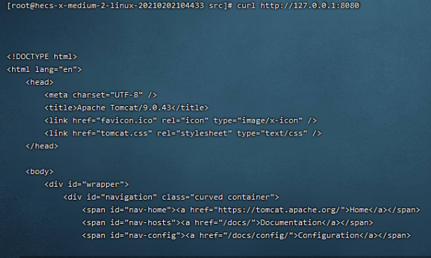

2.  通过修改本地 host 文件，将 www.123.com 映射到 121.37.164.246（远程服务器ip）

```
121.37.164.246 www.123.com
```


配置完成之后，我们便可以通过 www.123.com:8080 访问到第一步出现的 Tomcat 初始界面。那么如何只需要输入 www.123.com 便可以跳转到 Tomcat 初始界面呢？便用到 nginx 的反向代理。

3.  在 nginx.conf 配置文件中增加如下配置

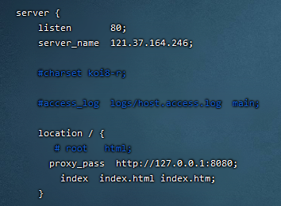

## 4.3 反向代理实例二

实现效果：使用 nginx 反向代理，根据访问的路径跳转到不同端口的服务中 nginx 监听端口为 9001。

访问 http://121.37.164.246:9001/edu/ 直接跳转到 127.0.0.1:8081

访问 http://121.37.164.246:9001/vod/ 直接跳转到 127.0.0.1:8082

### 4.3.1 实验代码

**第一步，**准备两个 tomcat，一个 8001 端口，一个 8002 端口，并准备好测试的页面（并放到tomcat webapps下）

**第二步**，修改 nginx 的配置文件

在 http 块中添加 server{}

```
  server {
        listen       9001;
        # 远程ip地址
        server_name  121.37.164.246;
  location ~ /edu/ {
     proxy_pass http://127.0.0.1:8080;
        }
  location ~ /vod/ {
      proxy_pass http://127.0.0.1:8081;
             }
    }              

```

**第三步，**重新启动nginx

在/usr/local/nginx/sbin 目录下执行

```
./nginx -s reload
```

**第四步，**测试

效果：

（1）访问vod，效果为


（2）访问：edu，效果为


**location 指令说明**

该指令用于匹配 URL。

语法如下：

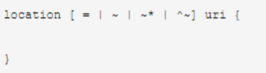

1、= ：用于不含正则表达式的 uri 前，要求请求字符串与 uri 严格匹配，如果匹配成功，就停止继续向下搜索并立即处理该请求。

2、\~：用于表示 uri 包含正则表达式，并且区分大小写。

3、\~\*：用于表示 uri 包含正则表达式，并且不区分大小写。

4、\^\~：用于不含正则表达式的 uri 前，要求 Nginx 服务器找到标识 uri 和请求字符串匹配度最高的 location 后，立即使用此 location 处理请求，而不再使用 location 块中的正则 uri 和请求字符串做匹配。

注意：如果 uri 包含正则表达式，则必须要有 \~ 或者 \~\* 标识。

# **第 5 章 nginx 配置实例-负载均衡**

实现效果：配置负载均衡（均摊到每一台服务器）

## **5.1 实验代码**

1） 首先准备两个同时启动的 Tomcat

2） 在 nginx.conf 中进行配置

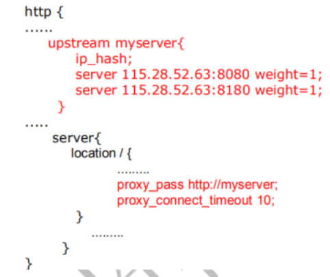

## 5.2 Nginx 四种分配策略

负载均衡即是将负载分摊到不同的服务单元，既保证服务的可用性，又保证响应足够快，给用户很好的体验。快速增长的访问量和数据流量催生了各式各样的负载均衡产品，很多专业的负载均衡硬件提供了很好的功能，但却价格不菲，这使得负载均衡软件大受欢迎， nginx 就是其中的一个，在 linux 下有 Nginx、LVS、Haproxy 等等服务可以提供负载均衡服务，而且 Nginx 提供了几种分配方式(策略)：

**1、轮询（默认）**

每个请求按时间顺序逐一分配到不同的后端服务器，如果后端服务器 down 掉，能自动剔除。

**2、weight（权重）**

weight 代表权,重默认为 1,权重越高被分配的客户端越多。

指定轮询几率，weight 和访问比率成正比，用于**后端服务器性能不均**的情况。例如：

```
upstream server_pool{
server 121.37.164.246 weight=10;
server 121.37.164.246 weight=10;
}

```

**3、ip_hash**

每个请求按访问 ip 的 hash 结果分配，这样**每个访客固定访问一个后端服务器**，可以解决 session 的问题。例如：

```
upstream server_pool{
#增加ip_hash
ip_hash;
server 121.37.164.246 weight=10;
server 121.37.164.246 weight=10;
}

```

**4、fair（第三方）**

按后端服务器的**响应时间**来分配请求，响应时间短的优先分配。

```
upstream server_pool{
server 121.37.164.246 weight=5;
server 121.37.164.246 weight=10;
fair;
}

```


# 第 6 章 nginx 配置实例-动静分离

目的：提高访问效率

**Nginx 动静分离简单来说就是把动态跟静态请求分开**，不能理解成只是单纯的把动态页面和静态页面物理分离。严格意义上说应该是动态请求跟静态请求分开，可以理解成使用 Nginx 处理静态页面，Tomcat 处理动态页面。动静分离从目前实现角度来讲大致分为两种：

一种是纯粹把静态文件独立成单独的域名，放在独立的服务器上，也是目前主流推崇的方案；

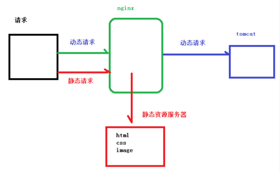

另外一种方法就是动态跟静态文件混合在一起发布，通过 nginx 来分开。

通过 location 指定不同的后缀名实现不同的请求转发。通过 expires 参数设置，可以使浏览器缓存过期时间，减少与服务器之前的请求和流量。具体 Expires 定义：是给一个资源设定一个过期时间，也就是说无需去服务端验证，直接通过浏览器自身确认是否过期即可，所以不会产生额外的流量。此种方法非常适合不经常变动的资源。（如果经常更新的文件，不建议使用 Expires 来缓存），我这里设置 3d，表示在这 3 天之内访问这个 URL，发送一个请求，比对服务器该文件最后更新时间没有变化，则不会从服务器抓取，返回状态码304，如果有修改，则直接从服务器重新下载，返回状态码 200。

## 6.1 实验代码

1.  项目资源准备

在 liunx 系统中准备静态资源，用于进行访问


2.进行 nginx 配置

找到 nginx 安装目录，打开/conf/nginx.conf 配置文件，并重新加载nginx

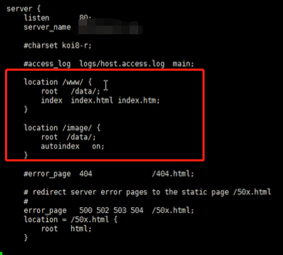

配置文件 autoindex on作用：

可以列出当前文件目录。


3、测试

（1）浏览器中输入地址


（2）在浏览器地址栏输入地址


重点是添加 location：

最后检查 Nginx 配置是否正确即可，然后测试动静分离是否成功，之需要删除后端 tomcat 服务器上的某个静态文件，查看是否能访问，如果可以访问说明静态资源 nginx 直接返回了，不走后端 tomcat 服务器

# 第七章nginx 搭建高可用集群

**Keepalived+Nginx 高可用集群（主从模式）**

上述采用nginx方式：

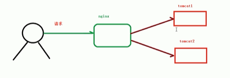

会有问题：

1.  nginx宕机

当nginx宕机后，所有请求均会失效。

解决方法：nginx集群实现高可用

1、什么是nginx高可用

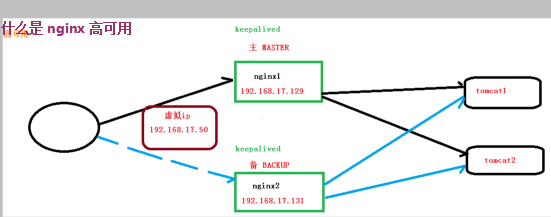

（1）需要两台 nginx 服务器

（2）需要 keepalived软件

（3）需要虚拟 ip

2、配置高可用准备工作

1.  需要两台服务器 192.168.17.129 和 192.168.17.131

2.  在两台服务器安装 nginx

3.  在两台服务器安装 keepalived

3、在两台服务器安装 keepalived

（1）使用 yum 命令进行安装

```
yum install keepalived --y
```

（2）安装之后，在 etc 里面生成目录 keepalived，有文件 keepalived.conf

4、完成高可用配置（主从配置）

（1）修改/etc/keepalived/keepalivec.conf 配置文件

```
global_defs {
notification_email {#指定keepalived在发生切换时需要发送email到的对象，一行一个
    acassen@firewall.loc
    failover@firewall.loc
    sysadmin@firewall.loc
}

notification_email_from Alexandre.Cassen@firewall.loc #指定发件人
smtp_server 192.168.17.129 #指定smtp服务器地址
smtp_connect_timeout 30#指定smtp连接超时时间
router_id LVS_DEVEL #运行keepalived机器的一个标识 （ifconfig查看）
}
vrrp_script chk_http_port { #检测脚本
script "/usr/local/src/nginx_check.sh"
interval 2	#（检测脚本执行的间隔）	
weight 2 	#权重	
	}		
vrrp_instance VI_1 {		
	state BACKUP	# 备份服务器上将 MASTER 改为 BACKUP	
	interface ens33	//服务器网卡	
	virtual_router_id 51   # 主、备机的 virtual_router_id 必须相同	
	priority 90	# 主、备机取不同的优先级，主机值较大，备份机值较小	
	advert_int 1		
authentication {
    auth_type PASS
    auth_pass 1111
}
virtual_ipaddress {  # 虚拟ip
192.168.17.50 // VRRP H 虚拟地址
    }
}


```

（2）在/usr/local/src 添加检测脚本nginx_check.sh

```
#!/bin/bash
A=`ps -C nginx –no-header |wc -l`
if [ $A -eq 0 ];then
    /usr/local/nginx/sbin/nginx
    sleep 2
    if [ `ps -C nginx --no-header |wc -l` -eq 0 ];then
        killall keepalived
    fi
fi

```

（3）把两台服务器上 nginx 和 keepalived 启动

启动 nginx：

./nginx

启动 keepalived：

systemctl start keepalived.service

5、最终测试

（1）在浏览器地址栏输入虚拟 ip 地址 192.168.17.50

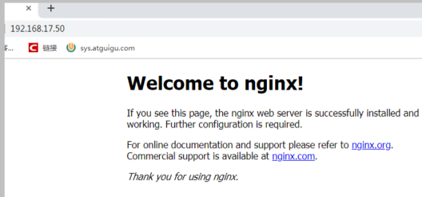

（2）把主服务器（192.168.17.129）nginx 和 keepalived 停止，再输入 192.168.17.50


总结：通过 keepalived软件对外暴露虚拟ip，对内做代理绑定nginx服务器，nginx服务器做转发。

# 第八章 nginx 原理与优化参数配置

## 1、master与worker

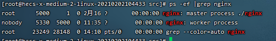

一个master（老板）多个worker(工人)，worker做事。

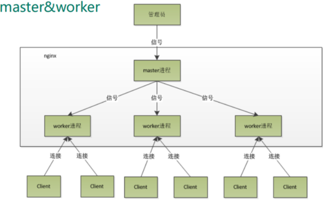

## 2、worker工作模式

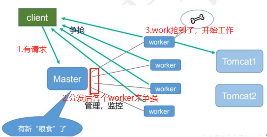

## 3、一个 master 和多个 woker 有好处

（1）可以使用 nginx --s reload 热部署，利用 nginx 进行热部署操作

（2）每个 woker 是独立的进程，如果有其中的一个 woker 出现问题，其他 woker [[是]{.ul}]()独立的，继续进行争抢，实现请求过程，不会造成服务中断。

## 4、设置多少个 woker 合适

**worker 数和服务器的 cpu 数相等是最为适宜的**

Nginx 同 redis 类似都采用了 [[IO]{.ul}]()多路复用机制，每个 worker 都是一个独立的进程，但每个进程里只有一个主线程，通过异步非阻塞的方式来处理请求，即使是千上万个请求也不在话

下。每个 worker 的线程可以把一个 cpu 的性能发挥到极致。所以 worker 数和服务器的 cpu 数相等是最为适宜的。设少了会浪费 cpu，设多了会造成 cpu 频繁切换上下文带来的损耗。

## 5、连接数 worker_connection

这个值是表示每个 worker 进程所能建立连接的最大值，所以，一个 nginx 能建立的最大连接数，应该是 worker_connections \* worker_processes。当然，这里说的是最大连接数，对于 HTTP 请求本地资源来说，能够支持的最大并发数量是 

worker_connections \*worker_processes，如果是支持 http1.1 的浏览器每次访问要占两个连接

-   所以普通的静态访问最大并发数是： worker_connections \* worker_processes /2，

-   而如果是 HTTP 作为反向代理来说，最大并发数量应该是 worker_connections \*worker_processes/4。因为作为反向代理服务器，每个并发会建立与客户端的连接和与后端服务的连接，会占用两个连接。

注：worker_connections表示每个worker最大连接数

worker_processes 表示 worker数量

每个worker占用2个或4个连接数：静态2个，动态4个。

静态：（worker直接返回静态资源）


动态：（worker需要请求tomcat服务器）

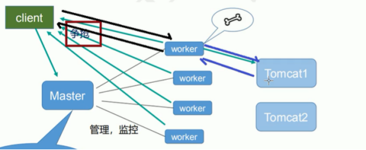
