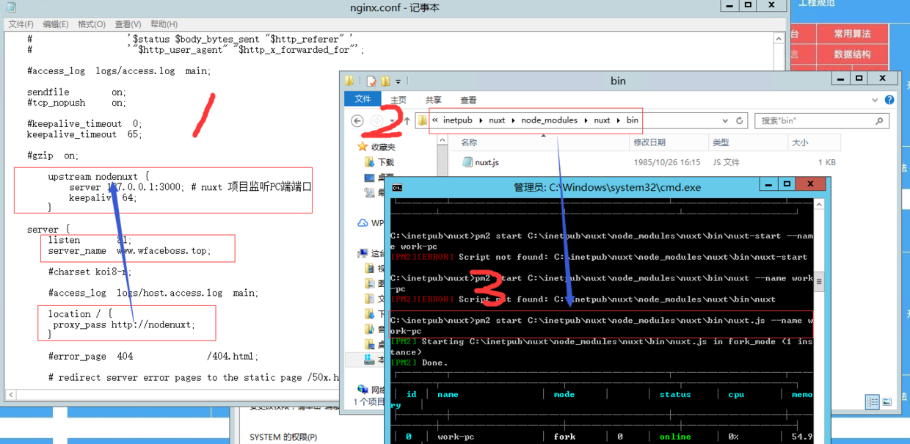

##a.为什么？
Vue.js原来是开发SPA（单页应用）的,但很多人想用Vue开发多页应用（有利于SEO操作），并在服务端完成渲染，于是Nuxt.js框架出生了，可实现用命令把vue项目生成为静态html。

###b.是什么？
Nuxt.js简单的说是Vue.js的通用框架，SSR，即服务器渲染，是在服务器端将对Vue页面进行渲染生成html文件，将html页面传递给浏览器。

 优点：
>基于 Vue.js
>自动代码分层
>服务端渲染
>强大的路由功能，支持异步数据
>静态文件服务
>ES6/ES7 语法支持
>打包和压缩 JS 和 CSS
>HTML头部标签管理
>本地开发支持热加载
>集成ESLint
>支持各种样式预处理器： SASS、LESS、 Stylus等等

前提：已经在系统中安装了Node.js [Node.js ](https://www.liaoxuefeng.com/wiki/1022910821149312/1023025597810528)
##1.nuxt.js安装
(1)用npm来安装`vue-cli`框架
```
npm install vue-cli -g
```
(2)使用vue安装 nuxt
安装`vue-cli`后，就可以使用init命令来初始化Nuxt.js项目
```
vue init nuxt/starter
```
(3)使用`npm install`安装依赖包
```
npm install
```
(4)使用`npm run dev` 启动服务
```
npm run dev
```
(5)在浏览器输入 localhost:3000,可以看到结果

##2.`package.json`配置
（1）端口配置
```
"config":{
    "nuxt":{
      "host":"127.0.0.1",
      "port":"1818"
    }
  },
```
##3.配置全局CSS
(1)在assets下新建css文件夹，并新建`normailze.css`(可以网上寻找相关初始化样式库)
(2)配置
在`/nuxt.config.js`下配置
```
css:['~assets/css/normailze.css'],
```

##4.默认模板
在根目录下创建一个`app.html`
```
<!DOCTYPE html>
<html lang="en">
<head>
   {{ HEAD }}
</head>
<body>
    {{ APP }}
</body>
</html>
```
**注意：这里的{{ HEAD }}读取的是nuxt.config.js里的信息，{{APP}} 就是我们写的pages文件夹下的主体页面了。需要注意的是HEAD和APP都需要大写，如果小写会报错的。**
默认模板配置完成后，要重启服务器，否则你的显示不会成功；但是默认布局是不用重启服务器的。

##5.错误页面配置 `error.vue`
在`layouts` 下新建`error.vue`文件

##6.引入`element ui `
(1)安装 `element-ui`
```
npm i element-ui -S
```
(2)在根目录下的plugins下创建`element-ui.js`文件
```
import Vue from 'vue'

import {Alert} from "element-ui";
Vue.prototype.$ELEMENT = { size: 'small' };
Vue.use(Alert)

```
(3)修改`nuxt.config.js`文件
```
 css:[
    {src:'element-ui/lib/theme-chalk/index.css'}
  ],
 
  plugins: [{
    src:'~plugins/element-ui',
    ssr: true //是能在服务端运行
  }]
```

##7.封装`axios`
(1)安装`axios`
```
npm install axios --save
```
(2)在plugins文件夹下面创建`request.js`

```
import * as axios from 'axios'

import {Message, Notification} from 'element-ui'

let service = axios.create({
  baseURL: 'https://interface.meiriyiwen.com',//域名信息-测试
  timeout: 10000
})

// 请求拦截 可在请求头中加入token等
service.interceptors.request.use(config => {
  return config
}, error => {
  return Promise.reject(error)
})

// 响应拦截 对响应消息作初步的处理
service.interceptors.response.use(resp => {
  if (resp.data) {
    if (resp.data.code !== '10000') {
      Message({
        type: 'error',
        message: resp.data.message,
        duration: 5000
      })
    }
    return {code: resp.data.code, data: resp.data.data, msg: resp.data.message}
  } else {
    return resp
  }
}, error => {
  if (error.response) {
    switch (error.response.states) {
      case 400: {
        if (error.response && error.response.data && error.response.data.message) {
          Notification.error({
            title: '400错误',
            message: error.response.data.message,
            duration: 5000,
            closable: true
          })
        }
        break
      }
    }
  }
})

export default service

```
(3)创建统一接口文件
在一级目录创建api文件夹,在api文件夹下面创建demo.js(可根据后台接口自定义命名)
`/demo.js代码`

```
import request from '@/plugins/request'

//测试接口
export function getDemoinfo (params) {
  return request({
    url: '/article/today?dev=1',//测试
    method: 'get',
    params: params
  })
}

```
（4）组件内调用接口
```
<template>
  <div>
    <el-alert
      title="成功提示的文案"
      type="success">
    </el-alert>
    <div>
      {{content}}
    </div>
  </div>
</template>

<script>
  import {getDemoinfo} from '@/api/demo'

  export default {
    components: {},
    data() {
      return {
        content: ""
      }
    },
    created() {
      getDemoinfo().then(res => {
        console.log(res.data)
        this.content = res.data.content;

      }).catch(error => {
        console.log("error", error)
      })
    }
  }
</script>

<style>

</style>
```
此时的项目目录为：


##8.部署到服务器上
前提：nuxt是基于nodejs运行的，安装node是第一步，因此确保已经安装 [Node.js ](https://www.liaoxuefeng.com/wiki/1022910821149312/1023025597810528)
（1）nuxt项目打包
详细请移步[nuxt官网](https://zh.nuxtjs.org/guide/commands/)
第一步、在本地 `npm run build`,会在.nuxt文件夹下生成dist文件;

第二步、把本地文件的`.nuxt`,`static`,`package.json`,`nuxt.config.js,`这四个文件夹放到服务器目录文件下
比如我在服务器上创建了C:\inetpub\nuxt路径。

第三步、用cmd进入目录文件夹，安装依赖
```
npm install -production
```

第四步、运行
```
npm start
```
此时运行的是 [http://localhost:1818](http://localhost:1818/);

目录以及项目文件如下：


此时项目在服务器的本地已经可以访问了，但在外部网络是无法进行访问的。这时Nginx就可以出场了。
目的是通过域名访问到nuxt服务（此处测试的域名为www.wfaceboss.top）

##9. [Nginx](http://www.seekl.net/)

(1)Nginx安装
第一步、Nginx 的安装步骤比较简单，安装在windows上推荐使用压缩包的安装方式，[下载地址](http://nginx.org/en/download.html);（选择稳定版本）
学习地址：https://gitee.com/FelixBinCloud/wfaceboss-study-notes/tree/master/nginx

第二步、下载完成之后，进行解压可以看到如下文件结构


第三步、双击`nginx.exe` 就启动了

在页面输入localhost。出现如下界面则表示安装成功。默认监听80端口号


第四步、若你的服务器上80端口被占用，则需要修改端口，操作如下：(我这里是将80修改成81，注意修改的端口需要服务器后台已经开放)
修改`nginx`安装目录`/conf/nginx.conf`中的`server`配置
```
#user  nobody;
worker_processes  1;

#error_log  logs/error.log;
#error_log  logs/error.log  notice;
#error_log  logs/error.log  info;

#pid        logs/nginx.pid;
events {
    worker_connections  1024;
}


http {
    include       mime.types;
    default_type  application/octet-stream;

    #log_format  main  '$remote_addr - $remote_user [$time_local] "$request" '
    #                  '$status $body_bytes_sent "$http_referer" '
    #                  '"$http_user_agent" "$http_x_forwarded_for"';

    #access_log  logs/access.log  main;

    sendfile        on;
    #tcp_nopush     on;

    #keepalive_timeout  0;
    keepalive_timeout  65;

    #gzip  on;

	upstream nodenuxt {
            server 127.0.0.1:3000; # nuxt 项目监听PC端端口
            keepalive 64;
        }

    server {
        listen       81;
        server_name  www.wfaceboss.top;

        #charset koi8-r;

        #access_log  logs/host.access.log  main;

        location / {
	 proxy_pass http://nodenuxt;
        }

        #error_page  404              /404.html;

        # redirect server error pages to the static page /50x.html
        #
        error_page   500 502 503 504  /50x.html;
        location = /50x.html {
            root   html;
        }

        # proxy the PHP scripts to Apache listening on 127.0.0.1:80
        #
        #location ~ \.php$ {
        #    proxy_pass   http://127.0.0.1;
        #}

        # pass the PHP scripts to FastCGI server listening on 127.0.0.1:9000
        #
        #location ~ \.php$ {
        #    root           html;
        #    fastcgi_pass   127.0.0.1:9000;
        #    fastcgi_index  index.php;
        #    fastcgi_param  SCRIPT_FILENAME  /scripts$fastcgi_script_name;
        #    include        fastcgi_params;
        #}

        # deny access to .htaccess files, if Apache's document root
        # concurs with nginx's one
        #
        #location ~ /\.ht {
        #    deny  all;
        #}
    }


    # another virtual host using mix of IP-, name-, and port-based configuration
    #
    #server {
    #    listen       8000;
    #    listen       somename:8080;
    #    server_name  somename  alias  another.alias;

    #    location / {
    #        root   html;
    #        index  index.html index.htm;
    #    }
    #}


    # HTTPS server
    #
    #server {
    #    listen       443 ssl;
    #    server_name  localhost;

    #    ssl_certificate      cert.pem;
    #    ssl_certificate_key  cert.key;

    #    ssl_session_cache    shared:SSL:1m;
    #    ssl_session_timeout  5m;

    #    ssl_ciphers  HIGH:!aNULL:!MD5;
    #    ssl_prefer_server_ciphers  on;

    #    location / {
    #        root   html;
    #        index  index.html index.htm;
    #    }
    #}

}

```
(2)Nginx启动
在nginx根目录下打开cmd命令窗口，启动Nginx
```
start nginx
```
其他命令
```
nginx -s reload //重新载入nginx(当配置信息发生修改时)

nginx -s quit //停止ngix 

nginx -h 查看帮助信息
```
完成以上配置，当你打开浏览器 输入http://www.wfaceboss.top:81即可访问到nuxt服务了。

**注意：若是多次修改/conf/nginx.conf文件 后重启nginx ，在windows可能会出现多个nginx 进程服务，需要结束这些进程，然后重启方可解决。**

通过上述的操作我们已经实现用域名访问nuxt服务了，但关闭服务器上nuxt运行黑窗口时，服务就断了，我们不能实时盯着他吧，因此就需要PM2进行守护了。


##10.[pm2进程管理](https://pm2.keymetrics.io/docs/usage/quick-start/)

（1）`pm2`需要全局安装
```
npm install -g pm2
```
(2)`pm2`启动`nuxt`项目
--cd 到项目目录
--启动

```
pm2 start /node_modules/nuxt/bin/nuxt.js --name 项目名称             (项目目录的node_modules包)
```
**注意：xxx是项目名称，即package.json中的name**
比如我当前为：


(3)`pm2`其他命令
```
pm2 list
pm2 show 0                           #查看进程详细信息，0为PM2进程id 
pm2 stop all                         #停止PM2列表中所有的进程
pm2 stop 0                           #停止PM2列表中进程为0的进程
pm2 reload all                       #重载PM2列表中所有的进程
pm2 reload 0                         #重载PM2列表中进程为0的进程
pm2 delete 0                         #删除PM2列表中进程为0的进程
pm2 delete all                       #删除PM2列表中所有的进程
```

到此我们基本完成nuxt项目从零到项目部署的搭建过程.