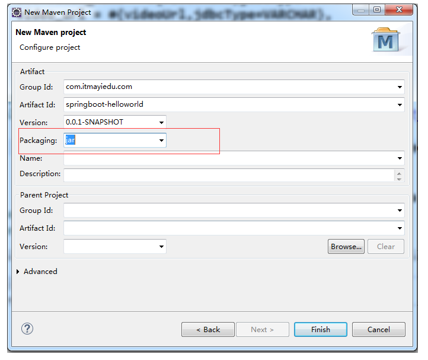
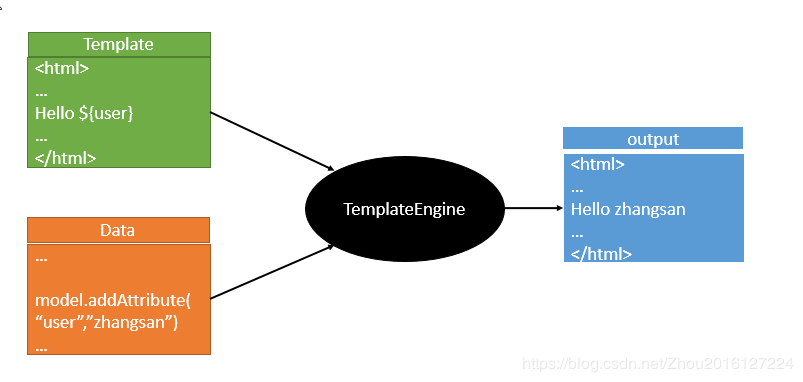

# **SpringBoot2.0**

# **一、Spring介绍**

## **1.1、SpringBoot简介**


Spring Boot让我们的Spring应用变的更轻量化。比如：你可以仅仅依靠一个Java类来运行一个Spring引用。你也可以打包你的应用为jar并通过使用java -jar来运行你的Spring Web应用。

Spring Boot的主要优点：

- 为所有Spring开发者更快的入门

- 开箱即用，提供各种默认配置来简化项目配置

- 内嵌式容器简化Web项目

- 没有冗余代码生成和XML配置的要求

本章主要目标完成Spring Boot基础项目的构建，并且实现一个简单的Http请求处理，通过这个例子对Spring Boot有一个初步的了解，并体验其结构简单、开发快速的特性。


SpringBoot 是一个快速开发的框架,能够快速的整合第三方框架，简化XML配置，全部采用注解形式，内置Tomcat容器,帮助开发者能够实现快速开发，SpringBoot的Web组件 默认集成的是SpringMVC框架。

SpringMVC是控制层。


- **SpringBoot 是一个快速开发的框架,能够快速的整合第三方框架**，--原理（Maven依赖封装）

- 简化XML配置，全部采用**注解形式**，--spring 体系支持注解启动，只是做了包装

- **内置Tomcat容器**,（tomcat,jetty,undertow）---java语言创建服务器


## **1.2、系统要求**

- java1.8及以上

- Spring Framework 5及以上

**本文采用**Java 1.8.0_73**、**Spring Boot 2.1.8 版本**调试通过。**


## **1.3、SpringBoot和SpringMVC区别**

- SpringBoot 是一个快速开发的框架,能够快速的整合第三方框架，简化XML配置，全部采用注解形式，内置Tomcat容器,帮助开发者能够实现快速开发，0- - SpringBoot的Web组件 默认集成的是SpringMVC框架。

- SpringMVC是控制层。


### **1.4、SpringBoot和SpringCloud区别**

- **SpringBoot 是一个快速开发的框架,能够快速的整合第三方框架，简化XML配置，全部采用注解形式，内置Tomcat容器**,帮助开发者能够实现快速开发，SpringBoot的Web组件 默认集成的是SpringMVC框架。

- SpringMVC是控制层。

- SpringCloud依赖于SpringBoot组件，使用SpringMVC编写Http协议接口，同时**SpringCloud是一套完整的微服务解决框架**。

**1.5常见错误**

Eclipse 下载SpringBoot2.0以上版本,pom文件报错解决办法

```
org.apache.maven.archiver.MavenArchiver.getManifest(org.apache.maven.project.MavenProject, org.apache.maven.archiver.MavenArchiveConfiguration)
```

相关网址: http://bbs.itmayiedu.com/article/1527749194015


# **二、快速入门**

## **2.1、创建一个Maven工程**

**名为”springboot-helloworld” 类型为Jar工程项目**



## **2.2、pom文件引入依赖**


```
<parent>
		<groupId>org.springframework.boot</groupId>
		<artifactId>spring-boot-starter-parent</artifactId>
		<version>2.1.8.RELEASE</version>
</parent>
	<dependencies>
		<dependency>
			<groupId>org.springframework.boot</groupId>
			<artifactId>spring-boot-starter-web</artifactId>
		</dependency>
	</dependencies> 
```


- **spring-boot-starter-parent作用**

在`pom.xml`中引入`spring-boot-start-parent`,spring官方的解释叫什么stater poms,它可以提供dependency management,也就是说依赖管理，引入以后在申明其它dependency的时候就不需要version了，后面可以看到

- **spring-boot-starter-web作用**

springweb 核心组件

- **spring-boot-maven-plugin作用**

如果我们要直接Main启动spring，那么以下plugin必须要添加，否则是无法启动的。如果使用maven 的spring-boot:run的话是不需要此配置的。（我在测试的时候，如果不配置下面的plugin也是直接在Main中运行的。）


**2.3、编写HelloWorld服务**

创建package命名为`top.wfaceboss.api.service`（根据实际情况修改）

创建`HelloService类`，内容如下

```
@RestController
@EnableAutoConfiguration
public class HelloService {
	@RequestMapping("/hello")
	public String index() {
		return "Hello World";
	}	
public static void main(String[] args) {
		SpringApplication.run(HelloService.class, args);
	}
}
```

## **2.4、@RestController**

**在上加上`RestController `表示修饰该Controller所有的方法返回JSON格式,直接可以编写Restful接口**

## **2.5、@EnableAutoConfiguration**

注解:作用在于让 Spring Boot  根据应用所声明的依赖来对 Spring 框架进行自动配置

这个注解告诉Spring Boot根据添加的jar依赖猜测你想如何配置Spring。由于spring-boot-starter-web添加了Tomcat和Spring MVC，所以auto-configuration将假定你正在开发一个web应用并相应地对Spring进行设置。

- @EnableAutoConfiguration扫包范围：当前类

- @ComponentScan作用范围：指定包范围

## **2.6 SpringApplication.run(HelloController.class, args);**

   标识为启动类

## **2.7、SpringBoot启动方式1**

Springboot默认端口号为8080

```
@RestController
@EnableAutoConfiguration
public class HelloService {
	@RequestMapping("/hello")
	public String index() {
		return "Hello World";
	}	 
public static void main(String[] args) {
		SpringApplication.run(HelloService.class, args);
	}
}
```

启动主程序，打开浏览器访问`http://localhost:8080/index `，可以看到页面输出Hello World

## **2.8、SpringBoot启动方式2**

`@ComponentScan(basePackages = "top.wfaceboss.api.service")`---控制扫包范围

```
@ComponentScan(basePackages = "top.wfaceboss.api.service")
@EnableAutoConfiguration
public class App {
	public static void main(String[] args) {
		SpringApplication.run(App.class, args);
	}
}
```

## **2.9、SpringBoot启动方式3**

`@SpringBootApplication`

`@SpringBootApplication` 被 `@Configuration`、`@EnableAutoConfiguration`、`@ComponentScan` 注解所修饰，换言之 Springboot 提供了统一的注解来替代以上三个注解

**扫包范围：在启动类上加上`@SpringBootApplication`注解,当前包下或者子包下所有的类都可以扫到。--扫包范围：当前同级包及一下子包**

**将**AppSpringBoot 建立在api层同级有controller以及service

```
@SpringBootApplication
public class AppSpringBoot {
    public static void main(String[] args) {
        SpringApplication.run(AppSpringBoot.class, args);
    }
}
```

SpringApplication启动的类必须是@SpringBootApplication注解标注的类


|                                       | 扫面包范围               |      |
| ------------------------------------- | ------------------------ | ---- |
| @EnableAutoConfiguration              | **当前注解类**           |      |
| @ComponentScan（basePackages=（包）） | **指定包范围**           |      |
| @SpringBootApplication                | **当前同级包及以下子包** |      |


# **三、Web开发**

参考：https://blog.csdn.net/Zhou2016127224/article/details/89886102

## **3.1、静态资源访问**

**1 以jar包的方式引入三方静态资源**

注:所有` /webjars/** `，都去 `classpath:/META-INF/resources/webjars/ `找资源；

原因：`*WebMvcAuotConfiguration*`

​	

```
@Override
public void addResourceHandlers(ResourceHandlerRegistry registry) {
			if (!this.resourceProperties.isAddMappings()) {
				logger.debug("Default resource handling disabled");
				return;
			}
			Integer cachePeriod = this.resourceProperties.getCachePeriod();
			if (!registry.hasMappingForPattern("/webjars/**")) {
				customizeResourceHandlerRegistration(
						registry.addResourceHandler("/webjars/**")
								.addResourceLocations(
								"classpath:/META-INF/resources/webjars/")
						.setCachePeriod(cachePeriod));
			}
			String staticPathPattern = this.mvcProperties.getStaticPathPattern();
          	//静态资源文件夹映射
			if (!registry.hasMappingForPattern(staticPathPattern)) {
				customizeResourceHandlerRegistration(
						registry.addResourceHandler(staticPathPattern)
								.addResourceLocations(
										this.resourceProperties.getStaticLocations())
						.setCachePeriod(cachePeriod));
			}
		}
```

```
  //配置欢迎页映射
@Bean
		public WelcomePageHandlerMapping welcomePageHandlerMapping(
				ResourceProperties resourceProperties) {
			return new WelcomePageHandlerMapping(resourceProperties.getWelcomePage(),
					this.mvcProperties.getStaticPathPattern());
		}

       //配置喜欢的图标
		@Configuration
		@ConditionalOnProperty(value = "spring.mvc.favicon.enabled", matchIfMissing = true)
		public static class FaviconConfiguration {

			private final ResourceProperties resourceProperties;

			public FaviconConfiguration(ResourceProperties resourceProperties) {
				this.resourceProperties = resourceProperties;
			}

			@Bean
			public SimpleUrlHandlerMapping faviconHandlerMapping() {
				SimpleUrlHandlerMapping mapping = new SimpleUrlHandlerMapping();
				mapping.setOrder(Ordered.HIGHEST_PRECEDENCE + 1);
              	//所有  **/favicon.ico 
				mapping.setUrlMap(Collections.singletonMap("**/favicon.ico",
						faviconRequestHandler()));
				return mapping;
			}

			@Bean
			public ResourceHttpRequestHandler faviconRequestHandler() {
				ResourceHttpRequestHandler requestHandler = new ResourceHttpRequestHandler();
				requestHandler
						.setLocations(this.resourceProperties.getFaviconLocations());
				return requestHandler;
			}

		}
```


**我们自己的资源包引用(在我们开发Web应用的时候，需要引用大量的js、css、图片等静态资源。)**

**"/\**"** 访问当前项目的任何资源，都去（静态资源的文件夹）找映射

**2 默认配置**

Spring Boot默认提供静态资源目录位置需置于classpath(类路径)下，**目录名**需符合如下规则：

- /static

- /public

- /resources	

- /META-INF/resources

举例：我们可以在`src/main/resources/`目录下创建`static`，在该位置放置一个图片文件。启动程序后，尝试访问`http://localhost:8080/D.jpg`。如能显示图片，配置成功。

注意：若出现404重新rebuild 在运行、

**3  欢迎页**

静态资源文件夹下的所有index.html页面；被"/**"映射；

localhost:8080/   找index页面


**4 所有的	` **/favicon.ico` 都是在静态资源文件下找**


同时也可在全局.properties中进行文件路径从配置，覆盖默认的配置。


## **3.2、渲染Web页面**



渲染Web页面

在之前的示例中，我们都是通过@RestController来处理请求，所以返回的内容为json对象。那么如果需要渲染html页面的时候，要如何实现呢？

模板引擎

在动态HTML实现上Spring Boot依然可以完美胜任，并且提供了多种模板引擎的默认配置支持，所以在推荐的模板引擎下，我们可以很快的上手开发动态网站。

模板引擎的目的：动态页面伪装静态化提高搜索引擎收录

Spring Boot提供了默认配置的**模板引擎**主要有以下几种：

- **Thymeleaf**

- FreeMarker

- Velocity

- Groovy

- Mustache

Spring Boot建议使用这些模板引擎，避免使用JSP，若一定要使用JSP将无法实现Spring Boot的多种特性，具体可见后文：支持JSP的配置

当你使用上述模板引擎中的任何一个，它们**默认的模板配置路径**为：`src/main/resources/templates`。当然也可以修改这个路径，具体如何修改，可在后续各模板引擎的配置属性中查询并修改。

## **3.3、Freemarker模板引擎渲染web视图**

### **3.3.1、pom文件引入**

```
<!-- 引入freeMarker的依赖包. -->
<dependency>
<groupId>org.springframework.boot</groupId>
<artifactId>spring-boot-starter-freemarker</artifactId>
</dependency>
```

### **3.3.2、后台代码**

```
@RequestMapping("/index")
	public String index(Map<String, Object> map) {
	    map.put("name","美丽的天使...");
	   return "index";
	}
```

### **3.3.3、前台代码**

在src/main/resources/创建一个templates文件夹,后缀为*.ftl


```
<!DOCTYPE html>
<html>
<head lang="en">
<meta charset="UTF-8" />
<title></title>
</head>
<body>
	  ${name}
</body> 
</html>
```

### **3.3.4、Freemarker其他用法**

```
@RequestMapping("/freemarkerIndex")
	public String index(Map<String, Object> result) {
		result.put("name", "yushengjun");
		result.put("sex", "0");
		List<String> listResult = new ArrayList<String>();
		listResult.add("zhangsan");
		listResult.add("lisi");
		listResult.add("itmayiedu");
		result.put("listResult", listResult);
		return "index";
	}
```

```
<!DOCTYPE html>
<html>
<head lang="en">
<meta charset="UTF-8" />
<title>首页</title>
</head>
<body>
	  ${name}
<#if sex=="1">
            男
      <#elseif sex=="2">
            女
     <#else>
        其他      
	  </#if>	  
	 <#list userlist as user>
	   ${user}
	 </#list>
</body> 
</html>
```

**3.3.5、Freemarker配置**

新建application.properties文件

```
########################################################
###FREEMARKER (FreeMarkerAutoConfiguration)
########################################################
spring.freemarker.allow-request-override=false
spring.freemarker.cache=true
spring.freemarker.check-template-location=true
spring.freemarker.charset=UTF-8
spring.freemarker.content-type=text/html
spring.freemarker.expose-request-attributes=false
spring.freemarker.expose-session-attributes=false
spring.freemarker.expose-spring-macro-helpers=false
#spring.freemarker.prefix=
#spring.freemarker.request-context-attribute=
#spring.freemarker.settings.*=
spring.freemarker.suffix=.ftl
spring.freemarker.template-loader-path=classpath:/templates/
#comma-separated list
#spring.freemarker.view-names= # whitelist of view names that can be resolved
```

或者`application.yml`文件


## **3.4、使用JSP渲染Web视图**

### **3.4.1、pom文件引入以下依赖**

```
<parent>
		<groupId>org.springframework.boot</groupId>
		<artifactId>spring-boot-starter-parent</artifactId>
		<version>2.0.0.RELEASE</version>
	</parent>
	<dependencies>
		<!-- SpringBoot web 核心组件 -->
		<dependency>
			<groupId>org.springframework.boot</groupId>
			<artifactId>spring-boot-starter-web</artifactId>
		</dependency>
		<dependency>
			<groupId>org.springframework.boot</groupId>
			<artifactId>spring-boot-starter-tomcat</artifactId>
		</dependency>
	<!-- SpringBoot 外部tomcat支持 -->	
	<dependency>
			<groupId>org.apache.tomcat.embed</groupId>
			<artifactId>tomcat-embed-jasper</artifactId>
		</dependency>
	</dependencies>
```

### **3.4.2、在application.properties创建以下配置**

```
spring.mvc.view.prefix=/WEB-INF/jsp/
spring.mvc.view.suffix=.jsp
```

### **3.4.3、后台代码**

```
@Controller
public class IndexController {
	@RequestMapping("/index")
	public String index() {
		return "index";
	}
}
```


注意:创建SpringBoot整合JSP，一定要为war类型，否则会找不到页面.

不要把JSP页面存放在resources// jsp 不能被访问到

## **3.5 使用ThymeLeaf渲染web视图**

官方文档：https://www.thymeleaf.org/documentation.html

### **3.5.1 pom.xml文件引入**

```
<!-- 第三方常用框架管理 -->
	<parent>
		<groupId>org.springframework.boot</groupId>
		<artifactId>spring-boot-starter-parent</artifactId>
		<version>2.0.0.RELEASE</version>
	</parent>
	<dependencies>
		<!-- SpringBoot web 核心组件 -->
		<dependency>
			<groupId>org.springframework.boot</groupId>
			<artifactId>spring-boot-starter-web</artifactId>
		</dependency>
		<!-- thymeleaf 依赖 -->
		<dependency>
			<groupId>org.springframework.boot</groupId>
			<artifactId>spring-boot-starter-thymeleaf</artifactId>
		</dependency>
	</dependencies>
```

### **3.5.2 后台代码**

```
@Controller
public class indexController {
	 @GetMapping("/index")
	public String index(Model model) {
		 model.addAttribute("name", "springboot2.0+thymeleaf succeed");
		return "index";
	}
}
```

### **3.5.3 前台代码**

在src/main/resource/创建一个templates文件夹,后缀为`*.html`

```
<!DOCTYPE HTML>
<html xmlns:th="http://www.thymeleaf.org">
<head>
    <title>hello</title>
    <meta http-equiv="Content-Type" content="text/html; charset=UTF-8" />
</head>
<body>
 <h1>你好</h1>
  <h1 th:text="${name}"></h1>
</body>
```

**原理：**

```
@ConfigurationProperties(prefix = "spring.thymeleaf")
public class ThymeleafProperties {

	private static final Charset DEFAULT_ENCODING = Charset.forName("UTF-8");

	private static final MimeType DEFAULT_CONTENT_TYPE = MimeType.valueOf("text/html");

	public static final String DEFAULT_PREFIX = "classpath:/templates/";

	public static final String DEFAULT_SUFFIX = ".html";
```

**使用：**

*导入thymeleaf的名称空间；*---起提示作用

```
<html lang="en" xmlns:th="http://www.thymeleaf.org">
```

### **3.5.4 thymeleaf配置文件**

在src/main/resource/创建一个`application.yml`

```
###ThymeLeaf配置
spring:
  thymeleaf:
    #模板的模式，支持 HTML, XML TEXT JAVASCRIPT
    mode: HTML5
    #编码 可不用配置
    encoding: UTF-8
    #内容类别,可不用配置
    content-type: text/html
    #开发配置为false,避免修改模板还要重启服务器
    cache: false
    #配置模板路径，默认是templates，可以不用配置
    prefix: classpath:/templates/
     # 配置视图路径后缀
    suffix: .html
```

### **3.5.5 启动类**

```
@SpringBootApplication
public class App {
	public static void main( String[] args )
    {
	// 程序入口，启动SpringBoot项目 项目创建内置tomcat服务器 使用tomcat加载springmvc 注解启动类
       SpringApplication.run(App.class,args);
    }
}
```


## **3.6、全局捕获异常**

- @ExceptionHandler 表示拦截异常

- @ControllerAdvice 是 controller 的一个辅助类，最常用的就是作为全局异常处理的切面类

- @ControllerAdvice 可以指定扫描范围

- @ControllerAdvice 约定了几种可行的返回值，如果是直接返回 model 类的话，需要使用 @ResponseBody 进行 json 转换

返回 String，表示跳到某个 view

返回 modelAndView

返回 `model + @ResponseBody`

```
@ControllerAdvice
public class GlobalExceptionHandler {
	@ExceptionHandler(RuntimeException.class)
	@ResponseBody
	public Map<String, Object> exceptionHandler() {
		Map<String, Object> map = new HashMap<String, Object>();
		map.put("errorCode", "101");
		map.put("errorMsg", "系統错误!");
		return map;
	}
}
```

# **四 数据访问**

## **4.1、springboot整合使用JdbcTemplate**

### **4.1.1 pom文件引入**

```
<parent>
		<groupId>org.springframework.boot</groupId>
		<artifactId>spring-boot-starter-parent</artifactId>
		<version>2.0.0.RELEASE</version>
	</parent>
	<dependencies>
		<!-- jdbcTemplate 依赖 -->
		<dependency>
			<groupId>org.springframework.boot</groupId>
			<artifactId>spring-boot-starter-jdbc</artifactId>
		</dependency>
		<!-- mysql 依赖 -->
		<dependency>
			<groupId>mysql</groupId>
			<artifactId>mysql-connector-java</artifactId>
<version>8.0.13</version>
		</dependency>
		<!-- 测试 -->
		<dependency>
			<groupId>org.springframework.boot</groupId>
			<artifactId>spring-boot-starter-test</artifactId>
			<scope>test</scope>
		</dependency>
		<!-- springboot-web组件 -->
		<dependency>
			<groupId>org.springframework.boot</groupId>
			<artifactId>spring-boot-starter-web</artifactId>
		</dependency>
	</dependencies>
```


### **4.1.2 application.properties新增配置**

```
spring.datasource.url=jdbc:mysql://localhost:3306/test
spring.datasource.username=root
spring.datasource.password=root
spring.datasource.driver-class-name=com.mysql.jdbc.Driver
```

**4.1.3 UserService类**


```
@Service
public class UserServiceImpl implements UserService {
	@Autowired
	private JdbcTemplate jdbcTemplate;
	public void createUser(String name, Integer age) {
		jdbcTemplate.update("insert into users values(null,?,?);", name, age);
	}
}
```


### **4.1.4 App类**

```
@SpringBootApplication
public class App {
	public static void main(String[] args) {
		SpringApplication.run(App.class, args);
	}
}
```


**注意: spring-boot-starter-parent要在1.5以上**

## **4.2、springboot整合使用mybatis**

### **4.2.1、pom文件引入**

```
<parent>
		<groupId>org.springframework.boot</groupId>
		<artifactId>spring-boot-starter-parent</artifactId>
		<version>2.0.0.RELEASE</version>
	</parent>
	<dependencies>
		<dependency>
			<groupId>org.springframework.boot</groupId>
			<artifactId>spring-boot-starter</artifactId>
		</dependency>
		<!-- 测试 -->
		<dependency>
			<groupId>org.springframework.boot</groupId>
			<artifactId>spring-boot-starter-test</artifactId>
			<scope>test</scope>
		</dependency>
		<dependency>
			<groupId>org.mybatis.spring.boot</groupId>
			<artifactId>mybatis-spring-boot-starter</artifactId>
			<version>1.1.1</version>
		</dependency>
		<!-- mysql 依赖 -->
		<dependency>
			<groupId>mysql</groupId>
			<artifactId>mysql-connector-java</artifactId>
		</dependency>
		<!-- springboot-web组件 -->
		<dependency>
			<groupId>org.springframework.boot</groupId>
			<artifactId>spring-boot-starter-web</artifactId>
		</dependency>
	</dependencies>
```


### **4.2.2、配置文件引入**

```
spring.datasource.url=jdbc:mysql://localhost:3306/test
spring.datasource.username=root
spring.datasource.password=root
spring.datasource.driver-class-name=com.mysql.jdbc.Driver
```

### **4.2.3、Mapper代码**

```
public interface UserMapper {
	@Select("SELECT * FROM USERS WHERE NAME = #{name}")
	User findByName(@Param("name") String name);
	@Insert("INSERT INTO USERS(NAME, AGE) VALUES(#{name}, #{age})")
	int insert(@Param("name") String name, @Param("age") Integer age);
}
```

### **4.2.4、启动方式**

```
@MapperScan("top.wfaceboss.mapper")
@SpringBootApplication
public class MybatisApp {
	public static void main(String[] args) {
		SpringApplication.run(MybatisApp.class, args);
	}
}
```

### **4.2.5、Mybatis整合分页插件**

**pageHelper**

PageHelper 是一款好用的开源免费的 Mybatis 第三方物理分页插件

物理分页

支持常见的 12 种数据库。Oracle,MySql,MariaDB,SQLite,DB2,PostgreSQL,SqlServer 等

支持多种分页方式

支持常见的 RowBounds(PageRowBounds)，PageHelper.startPage 方法调用，Mapper 接口参数调用

**Maven依赖**

```
<parent>
		<groupId>org.springframework.boot</groupId>
		<artifactId>spring-boot-starter-parent</artifactId>
		<version>2.0.0.RELEASE</version>
	</parent>
	<dependencies>
		<dependency>
			<groupId>org.projectlombok</groupId>
			<artifactId>lombok</artifactId>
		</dependency>
		<dependency>
			<groupId>org.springframework.boot</groupId>
			<artifactId>spring-boot-starter</artifactId>
		</dependency>
		<!-- 测试 -->
		<dependency>
			<groupId>org.springframework.boot</groupId>
			<artifactId>spring-boot-starter-test</artifactId>
			<scope>test</scope>
		</dependency>
		<dependency>
			<groupId>org.mybatis.spring.boot</groupId>
			<artifactId>mybatis-spring-boot-starter</artifactId>
			<version>1.1.1</version>
		</dependency>
		<!-- mysql 依赖 -->
		<dependency>
			<groupId>mysql</groupId>
			<artifactId>mysql-connector-java</artifactId>
		</dependency>
		<!-- springboot-web组件 -->
		<dependency>
			<groupId>org.springframework.boot</groupId>
			<artifactId>spring-boot-starter-web</artifactId>
		</dependency>
		<!-- springboot 整合 pagehelper -->
		<dependency>
			<groupId>com.github.pagehelper</groupId>
			<artifactId>pagehelper-spring-boot-starter</artifactId>
			<version>1.2.5</version>
		</dependency>
		<dependency>
			<groupId>org.apache.commons</groupId>
			<artifactId>commons-lang3</artifactId>
			<version>3.7</version>
		</dependency>
	</dependencies>
```


**配置文件**

```
spring.datasource.url=jdbc:mysql://localhost:3306/test
spring.datasource.username=root
spring.datasource.password=root
spring.datasource.driver-class-name=com.mysql.jdbc.Driver
logging.level.com.example.demo.dao=DEBUG
pagehelper.helperDialect=mysql
pagehelper.reasonable=true
pagehelper.supportMethodsArguments=true
pagehelper.params=count=countSql
pagehelper.page-size-zero=true
```


**Entity层**

```
@Data
public class User {
	private Integer id;
	private String name;
	private Integer age;
}
```


**Mapper层**

```
public interface UserMapper {
	@Select("SELECT * FROM USERS ")
	List<User> findUserList();
}
```

**Service层**

```
@Service
public class UserService {
	@Autowired
	private UserMapper userMapper;
	/**
	 * page 当前页数<br>
	 * size 当前展示的数据<br>
	 * 作者: 每特教育-余胜军<br>
	 * 联系方式:QQ644064779|WWW.itmayiedu.com<br>
	 * 
	 * @param page
	 * @param size
	 * @return
	 */
	public PageInfo<User> findUserList(int page, int size) {
		// 开启分页插件,放在查询语句上面
		PageHelper.startPage(page, size);
		List<User> listUser = userMapper.findUserList();
		// 封装分页之后的数据
		PageInfo<User> pageInfoUser = new PageInfo<User>(listUser);
		return pageInfoUser;
	}
}
```


**Controller层**

```
@RestController
public class IndexController {
	@Autowired
	private UserService userService;
	@RequestMapping("/findUserList")
	public PageInfo<User> findUserList(int page, int size) {
		return userService.findUserList(page, size);
	}
}
```

**启动项目**

```
@MapperScan("top.wfaceboss.mapper")
@SpringBootApplication
public class PageHelper {
	public static void main(String[] args) {
		SpringApplication.run(PageHelper.class, args);
	}
}
```


## **4.3、springboot整合使用spring data jpa**

### **4.3.1 pom文件引入依赖**

```
    <parent>
		<groupId>org.springframework.boot</groupId>
		<artifactId>spring-boot-starter-parent</artifactId>
		<version>2.0.0.RELEASE</version>
	</parent>
	<dependencies>
<!-- springboot2.0集成web组件 -->
<dependency>
			<groupId>org.springframework.boot</groupId>
			<artifactId>spring-boot-starter-web</artifactId>
		</dependency>
<!-- springboot2.0集成springDataJpa -->
		<dependency>
			<groupId>org.springframework.boot</groupId>
			<artifactId>spring-boot-starter-data-jpa</artifactId>
		</dependency>
	<!--springboot2.0集成mysql8驱动  -->
		<dependency>
			<groupId>mysql</groupId>
			<artifactId>mysql-connector-java</artifactId>
<version>8.0.13</version> 
		</dependency>
	</dependencies>
```


### **4.3.2 创建User实体类**


```
@Entity(name = "users")
public class UserEntity {
	@Id
	@GeneratedValue(strategy = GenerationType.IDENTITY)
	private Integer id;
	@Column(name = "name")
	private String name;
	@Column(name = "age")
	private Integer age;
}
```


### **4.3.3 创建UserDao**

*DAO**类都是进行数据操作的类*

```
public interface UserDao extends JpaRepository<User, Integer> {
}
```


### **4.3.4 创建IndexController**

```
@RestController
public class IndexController {
	@Autowired
	private UserDao userDao;
	@RequestMapping("/jpaFindUser")
	public Object jpaIndex(UserEntity user) {
		Optional<User> userOptional = userDao.findById(user.getId());
		User reusltUser = userOptional.get();
		return reusltUser == null ? "没有查询到数据" : reusltUser;
	}
}
```

### **4.3.5 启动项目**

```
@SpringBootApplication
public class JpaApp {
	public static void main(String[] args) {
		SpringApplication.run(JpaApp.class, args);
	}
}
```

## **4.4、springboot整合多数据源**

原理使用根据包名，加载不同的数据源

分布式：一个大项目拆分成n多个不同子项目，子项目之前采用rpc远程调用通讯技术


### **4.4.1 配置文件中新增两个数据源**

```
###datasource1
spring.datasource.test1.driver-class-name = com.mysql.jdbc.Driver
spring.datasource.test1.jdbc-url = jdbc:mysql://localhost:3306/test01?useUnicode=true&characterEncoding=utf-8
spring.datasource.test1.username = root
spring.datasource.test1.password = root
###datasource2
spring.datasource.test2.driver-class-name = com.mysql.jdbc.Driver
spring.datasource.test2.jdbc-url = jdbc:mysql://localhost:3306/test02?useUnicode=true&characterEncoding=utf-8
spring.datasource.test2.username = root
spring.datasource.test2.password = root
```


### **4.4.2 配置文件中新增两个数据源**

```
//DataSource01
@Configuration // 注册到springboot容器中
@MapperScan(basePackages = "com.itmayiedu.test01", sqlSessionFactoryRef = "test1SqlSessionFactory")
public class DataSource1Config {
	/**
	 * 
	 * @methodDesc: 功能描述:(配置test1数据库)
	 * @returnType:@return DataSource
	*/
	@Bean(name = "test1DataSource")
	@ConfigurationProperties(prefix = "spring.datasource.test1")
	@Primary
	public DataSource testDataSource() {
		return DataSourceBuilder.create().build();
	}
	/**
	 * 
	 * @methodDesc: 功能描述:(test1 sql会话工厂)
	 * @param: @param
	 * dataSource
	 * @param: @return
	 * @param: @throws
	 *  Exception
	* @returnType:@param dataSource
	 * @returnType:@return
	 * @returnType:@throws Exception SqlSessionFactory
		 */
	@Bean(name = "test1SqlSessionFactory")
	@Primary
	public SqlSessionFactory testSqlSessionFactory(@Qualifier("test1DataSource") DataSource dataSource)
			throws Exception {
		SqlSessionFactoryBean bean = new SqlSessionFactoryBean();
		bean.setDataSource(dataSource);
		// bean.setMapperLocations(
		// new
		// PathMatchingResourcePatternResolver().getResources("classpath:mybatis/mapper/test1/*.xml"));
		return bean.getObject();
	}
	/**
	 * @methodDesc: 功能描述:(test1 事物管理)
	* @param: @param
	 *dataSource
	 * @param: @return
	 * @param: @throws
	 *Exception
	 * @returnType:@param dataSource
	 * @returnType:@return
	 * @returnType:@throws Exception SqlSessionFactory
	 */
	@Bean(name = "test1TransactionManager")
	@Primary
	public DataSourceTransactionManager testTransactionManager(@Qualifier("test1DataSource") DataSource dataSource) {
		return new DataSourceTransactionManager(dataSource);
	}
	@Bean(name = "test1SqlSessionTemplate")
	@Primary
	public SqlSessionTemplate testSqlSessionTemplate(
			@Qualifier("test1SqlSessionFactory") SqlSessionFactory sqlSessionFactory) throws Exception {
		return new SqlSessionTemplate(sqlSessionFactory);
	}
}
//DataSource2
@Configuration // 注册到springboot容器中
@MapperScan(basePackages = "top.wfaceboss.test02", sqlSessionFactoryRef = "test2SqlSessionFactory")
public class DataSource2Config {
	/**
	 * @methodDesc: 功能描述:(配置test2数据库)
	* @param: @return
	 * @createTime:2017年9月17日 下午3:16:44
	 * @returnType:@return DataSource
	*/
	@Bean(name = "test2DataSource")
	@ConfigurationProperties(prefix = "spring.datasource.test2")
	public DataSource testDataSource() {
		return DataSourceBuilder.create().build();
	}
	/**
	 * 
	 * @methodDesc: 功能描述:(test2 sql会话工厂)
	 * @param: 
	 *ataSource
	 * @param: @return
	 * @param: @throws
	 *  Exception
	 * @returnType:@param dataSource
	 * @returnType:@return
	 * @returnType:@throws Exception SqlSessionFactory
	 */
	@Bean(name = "test2SqlSessionFactory")
	public SqlSessionFactory testSqlSessionFactory(@Qualifier("test2DataSource") DataSource dataSource)
			throws Exception {
		SqlSessionFactoryBean bean = new SqlSessionFactoryBean();
		bean.setDataSource(dataSource);
		// bean.setMapperLocations(
		// new
		// PathMatchingResourcePatternResolver().getResources("classpath:mybatis/mapper/test2/*.xml"));
		return bean.getObject();
	}
	/**
	 * @methodDesc: 功能描述:(test2 事物管理)
 * @param: @param
	 *dataSource
	 * @param: @return
	 * @param: @throws
	 * Exception
* @returnType:@param dataSource
	 * @returnType:@return
	 * @returnType:@throws Exception SqlSessionFactory
	 */
	@Bean(name = "test2TransactionManager")
	public DataSourceTransactionManager testTransactionManager(@Qualifier("test2DataSource") DataSource dataSource) {
		return new DataSourceTransactionManager(dataSource);
	}
	@Bean(name = "test2SqlSessionTemplate")
	public SqlSessionTemplate testSqlSessionTemplate(
			@Qualifier("test2SqlSessionFactory") SqlSessionFactory sqlSessionFactory) throws Exception {
		return new SqlSessionTemplate(sqlSessionFactory);
	}
}
```

### **4.4.3 创建分包Mapper** 

```
public interface User1Mapper {
	@Insert("insert into users values(null,#{name},#{age});")
	public int addUser(@Param("name") String name, @Param("age") Integer age);
}	
```

### **4.4.4 多数据源事务注意事项**

在多数据源的情况下，使用`@Transactional`注解时，应该指定事务管理者

`@Transactional(transactionManager = "test2TransactionManager")`

### **4.4.5 启动项目**

```
@SpringBootApplication
@MapperScan(basePackages = { "com.itmayiedu.mapper" })
public class App {
	public static void main(String[] args) {
		SpringApplication.run(App.class, args);
	}
}
```


```
No qualifying bean of type [javax.sql.DataSource] is defined: expected single matching bean but found 2: test1DataSource,test2DataSource
加上@Primary即可。


There was an unexpected error (type=Internal Server Error, status=500).
No qualifying bean of type 'org.springframework.transaction.PlatformTransactionManager' available: expected single matching bean but found 2: test1TransactionManager,test2TransactionManager
```


 指定事务管理器

Springboot1.5的时候 没有默认指向数据源 会报错

Springboot2.0的时候 不报错


# **五 事务管理**

## **5.1 SpringBoot整合事务管理**

 Springboot默认集成事物,只主要在方法上加上@Transactional即可

## **5.2 SpringBoot分布式事务管理**

使用`springboot+jta+atomikos `分布式事物管理

Atomikos 是一个为Java平台提供增值服务的并且开源类事务管理器。


### **5.2.1 新增jta-atomikos依赖**

```
<dependency>
	<groupId>org.springframework.boot</groupId>
	<artifactId>spring-boot-starter-jta-atomikos</artifactId>
</dependency>
```


### **5.2.2 新增配置文件信息**

```
# Mysql 1
mysql.datasource.test1.url = jdbc:mysql://localhost:3306/test01?useUnicode=true&characterEncoding=utf-8
mysql.datasource.test1.username = root
mysql.datasource.test1.password = root
mysql.datasource.test1.minPoolSize = 3
mysql.datasource.test1.maxPoolSize = 25
mysql.datasource.test1.maxLifetime = 20000
mysql.datasource.test1.borrowConnectionTimeout = 30
mysql.datasource.test1.loginTimeout = 30
mysql.datasource.test1.maintenanceInterval = 60
mysql.datasource.test1.maxIdleTime = 60
# Mysql 2
mysql.datasource.test2.url =jdbc:mysql://localhost:3306/test02?useUnicode=true&characterEncoding=utf-8
mysql.datasource.test2.username =root
mysql.datasource.test2.password =root
mysql.datasource.test2.minPoolSize = 3
mysql.datasource.test2.maxPoolSize = 25
mysql.datasource.test2.maxLifetime = 20000
mysql.datasource.test2.borrowConnectionTimeout = 30
mysql.datasource.test2.loginTimeout = 30
mysql.datasource.test2.maintenanceInterval = 60
mysql.datasource.test2.maxIdleTime = 60
```


### **5.2.3 读取配置文件信息**

```
@Data
@ConfigurationProperties(prefix = "mysql.datasource.test1")
public class DBConfig1 {
	private String url;
	private String username;
	private String password;
	private int minPoolSize;
	private int maxPoolSize;
	private int maxLifetime;
	private int borrowConnectionTimeout;
	private int loginTimeout;
	private int maintenanceInterval;
	private int maxIdleTime;
	private String testQuery;
}
@Data
@ConfigurationProperties(prefix = "mysql.datasource.test2")
public class DBConfig2 {
	private String url;
	private String username;
	private String password;
	private int minPoolSize;
	private int maxPoolSize;
	private int maxLifetime;
	private int borrowConnectionTimeout;
	private int loginTimeout;
	private int maintenanceInterval;
	private int maxIdleTime;
	private String testQuery;
}
```


### **5.2.4 创建多数据源**

```
@Configuration
// basePackages 最好分开配置 如果放在同一个文件夹可能会报错
@MapperScan(basePackages = "top.wfaceboss.test01", sqlSessionTemplateRef = "testSqlSessionTemplate")
public class MyBatisConfig1 {
	// 配置数据源
	@Primary
	@Bean(name = "testDataSource")
	public DataSource testDataSource(DBConfig1 testConfig) throws SQLException {
		MysqlXADataSource mysqlXaDataSource = new MysqlXADataSource();
		mysqlXaDataSource.setUrl(testConfig.getUrl());
		mysqlXaDataSource.setPinGlobalTxToPhysicalConnection(true);
		mysqlXaDataSource.setPassword(testConfig.getPassword());
		mysqlXaDataSource.setUser(testConfig.getUsername());
		mysqlXaDataSource.setPinGlobalTxToPhysicalConnection(true);
		AtomikosDataSourceBean xaDataSource = new AtomikosDataSourceBean();
		xaDataSource.setXaDataSource(mysqlXaDataSource);
		xaDataSource.setUniqueResourceName("testDataSource");
		xaDataSource.setMinPoolSize(testConfig.getMinPoolSize());
		xaDataSource.setMaxPoolSize(testConfig.getMaxPoolSize());
		xaDataSource.setMaxLifetime(testConfig.getMaxLifetime());
		xaDataSource.setBorrowConnectionTimeout(testConfig.getBorrowConnectionTimeout());
		xaDataSource.setLoginTimeout(testConfig.getLoginTimeout());
		xaDataSource.setMaintenanceInterval(testConfig.getMaintenanceInterval());
		xaDataSource.setMaxIdleTime(testConfig.getMaxIdleTime());
		xaDataSource.setTestQuery(testConfig.getTestQuery());
		return xaDataSource;
	}
	@Primary
	@Bean(name = "testSqlSessionFactory")
	public SqlSessionFactory testSqlSessionFactory(@Qualifier("testDataSource") DataSource dataSource)
			throws Exception {
		SqlSessionFactoryBean bean = new SqlSessionFactoryBean();
		bean.setDataSource(dataSource);
		return bean.getObject();
	}
	@Primary
	@Bean(name = "testSqlSessionTemplate")
	public SqlSessionTemplate testSqlSessionTemplate(
			@Qualifier("testSqlSessionFactory") SqlSessionFactory sqlSessionFactory) throws Exception {
		return new SqlSessionTemplate(sqlSessionFactory);
	}
}top.wfaceboss
@Configuration
@MapperScan(basePackages = "top.wfaceboss.test02", sqlSessionTemplateRef = "test2SqlSessionTemplate")
public class MyBatisConfig2 {
	// 配置数据源
	@Bean(name = "test2DataSource")
	public DataSource testDataSource(DBConfig2 testConfig) throws SQLException {
		MysqlXADataSource mysqlXaDataSource = new MysqlXADataSource();
		mysqlXaDataSource.setUrl(testConfig.getUrl());
		mysqlXaDataSource.setPinGlobalTxToPhysicalConnection(true);
		mysqlXaDataSource.setPassword(testConfig.getPassword());
		mysqlXaDataSource.setUser(testConfig.getUsername());
		mysqlXaDataSource.setPinGlobalTxToPhysicalConnection(true);
		AtomikosDataSourceBean xaDataSource = new AtomikosDataSourceBean();
		xaDataSource.setXaDataSource(mysqlXaDataSource);
		xaDataSource.setUniqueResourceName("test2DataSource");
		xaDataSource.setMinPoolSize(testConfig.getMinPoolSize());
		xaDataSource.setMaxPoolSize(testConfig.getMaxPoolSize());
		xaDataSource.setMaxLifetime(testConfig.getMaxLifetime());
		xaDataSource.setBorrowConnectionTimeout(testConfig.getBorrowConnectionTimeout());
		xaDataSource.setLoginTimeout(testConfig.getLoginTimeout());
		xaDataSource.setMaintenanceInterval(testConfig.getMaintenanceInterval());
		xaDataSource.setMaxIdleTime(testConfig.getMaxIdleTime());
		xaDataSource.setTestQuery(testConfig.getTestQuery());
		return xaDataSource;
	}
	@Bean(name = "test2SqlSessionFactory")
	public SqlSessionFactory testSqlSessionFactory(@Qualifier("test2DataSource") DataSource dataSource)
			throws Exception {
		SqlSessionFactoryBean bean = new SqlSessionFactoryBean();
		bean.setDataSource(dataSource);
		return bean.getObject();
	}
	@Bean(name = "test2SqlSessionTemplate")
	public SqlSessionTemplate testSqlSessionTemplate(
			@Qualifier("test2SqlSessionFactory") SqlSessionFactory sqlSessionFactory) throws Exception {
		return new SqlSessionTemplate(sqlSessionFactory);
	}
}
```

**5.2.4 启动加载配置**


```
@EnableConfigurationProperties(value = { DBConfig1.class, DBConfig2.class })
```


# **六 日志管理**

参考：https://blog.csdn.net/yu0_zhang0/article/details/83898819

**市面上的日志框架**

*JUL、JCL、Jboss-logging、logback、log4j、log4j2、slf4j…*

.png)


**日志的抽象层：**

- **JCL（Jakarta Commons Logging）---->最后一次更新2014年**

- **jboss-logging-------------->使用的场景太少了**

- **SLF4j了----------->springboot中使用的日志抽象层**

**日志实现：**

- **Logback----->Log4j的升级版本出至于同一个人开发------>又写出了SLF4j的日志抽象层使用起来更加灵活**

- **JUL（java.util.logging）--------->java util包下**

- **Log4j2--------->apache下生产的日志框架**

- **SpringBoot选用 SLF4j和logback**

**6.1 使用log4j记录日志**

### **6.1.1 新建log4j配置文件**

文件名称`log4j.properties`，注意路径

```
#log4j.rootLogger=CONSOLE,info,error,DEBUG
log4j.rootLogger=info,error,CONSOLE,DEBUG
log4j.appender.CONSOLE=org.apache.log4j.ConsoleAppender     
log4j.appender.CONSOLE.layout=org.apache.log4j.PatternLayout     
log4j.appender.CONSOLE.layout.ConversionPattern=%d{yyyy-MM-dd-HH-mm} [%t] [%c] [%p] - %m%n     
log4j.logger.info=info
log4j.appender.info=org.apache.log4j.DailyRollingFileAppender
log4j.appender.info.layout=org.apache.log4j.PatternLayout     
log4j.appender.info.layout.ConversionPattern=%d{yyyy-MM-dd-HH-mm} [%t] [%c] [%p] - %m%n  
log4j.appender.info.datePattern='.'yyyy-MM-dd
log4j.appender.info.Threshold = info   
log4j.appender.info.append=true   
#log4j.appender.info.File=/home/admin/pms-api-services/logs/info/api_services_info
log4j.appender.info.File=/Users/dddd/Documents/testspace/pms-api-services/logs/info/api_services_info
log4j.logger.error=error  
log4j.appender.error=org.apache.log4j.DailyRollingFileAppender
log4j.appender.error.layout=org.apache.log4j.PatternLayout     
log4j.appender.error.layout.ConversionPattern=%d{yyyy-MM-dd-HH-mm} [%t] [%c] [%p] - %m%n  
log4j.appender.error.datePattern='.'yyyy-MM-dd
log4j.appender.error.Threshold = error   
log4j.appender.error.append=true   
#log4j.appender.error.File=/home/admin/pms-api-services/logs/error/api_services_error
log4j.appender.error.File=/Users/dddd/Documents/testspace/pms-api-services/logs/error/api_services_error
log4j.logger.DEBUG=DEBUG
log4j.appender.DEBUG=org.apache.log4j.DailyRollingFileAppender
log4j.appender.DEBUG.layout=org.apache.log4j.PatternLayout     
log4j.appender.DEBUG.layout.ConversionPattern=%d{yyyy-MM-dd-HH-mm} [%t] [%c] [%p] - %m%n  
log4j.appender.DEBUG.datePattern='.'yyyy-MM-dd
log4j.appender.DEBUG.Threshold = DEBUG   
log4j.appender.DEBUG.append=true   
#log4j.appender.DEBUG.File=/home/admin/pms-api-services/logs/debug/api_services_debug
log4j.appender.DEBUG.File=/Users/dddd/Documents/testspace/pms-api-services/logs/debug/api_services_debug
log4j代码
private static final Logger logger = LoggerFactory.getLogger(IndexController.class);
```


 Maven依赖 

```
<parent>
		<groupId>org.springframework.boot</groupId>
		<artifactId>spring-boot-starter-parent</artifactId>
		<version>2.0.0.RELEASE</version>
	</parent>
	<dependencies>
		<!-- SpringBoot 核心组件 -->
		<dependency>
			<groupId>org.springframework.boot</groupId>
			<artifactId>spring-boot-starter-web</artifactId>
		</dependency>
		<dependency>
			<groupId>org.springframework.boot</groupId>
			<artifactId>spring-boot-starter-tomcat</artifactId>
		</dependency>
		<dependency>
			<groupId>org.apache.tomcat.embed</groupId>
			<artifactId>tomcat-embed-jasper</artifactId>
		</dependency>
		<!-- spring boot start -->
		<dependency>
			<groupId>org.springframework.boot</groupId>
			<artifactId>spring-boot-starter</artifactId>
			<exclusions>
				<!-- 排除自带的logback依赖 -->
				<exclusion>
					<groupId>org.springframework.boot</groupId>
					<artifactId>spring-boot-starter-logging</artifactId>
				</exclusion>
			</exclusions>
		</dependency>
		<!-- springboot-log4j -->
		<dependency>
			<groupId>org.springframework.boot</groupId>
			<artifactId>spring-boot-starter-log4j</artifactId>
			<version>1.3.8.RELEASE</version>
		</dependency>
	</dependencies>
```


## **6.2 使用AOP统一处理Web请求日志**

### **6.2.1 POM文件依赖**

```
	<parent>
		<groupId>org.springframework.boot</groupId>
		<artifactId>spring-boot-starter-parent</artifactId>
		<version>2.0.0.RELEASE</version>
	</parent>
	<dependencies>
		<!-- SpringBoot 核心组件 -->
		<dependency>
			<groupId>org.springframework.boot</groupId>
			<artifactId>spring-boot-starter-web</artifactId>
		</dependency>
		
		<!-- SpringBoot2.0整合aop技术 -->
		<dependency>
			<groupId>org.springframework.boot</groupId>
			<artifactId>spring-boot-starter-aop</artifactId>
		</dependency>
	</dependencies>
```


### **6.2.2 AOP定义日志**

```
@Aspect
@Component
public class WebLogAspect {
	private static final Logger logger = LoggerFactory.getLogger(WebLogAspect.class);
	@Pointcut("execution(public * com.itmayiedu.controller.*.*(..))")
	public void webLog() {
	}
	@Before("webLog()")
	public void doBefore(JoinPoint joinPoint) throws Throwable {
		// 接收到请求，记录请求内容
		ServletRequestAttributes attributes = (ServletRequestAttributes) RequestContextHolder.getRequestAttributes();
		HttpServletRequest request = attributes.getRequest();
		// 记录下请求内容
		logger.info("URL : " + request.getRequestURL().toString());
		logger.info("HTTP_METHOD : " + request.getMethod());
		logger.info("IP : " + request.getRemoteAddr());
		Enumeration<String> enu = request.getParameterNames();
		while (enu.hasMoreElements()) {
			String name = (String) enu.nextElement();
			logger.info("name:{},value:{}", name, request.getParameter(name));
		}
	}
	@AfterReturning(returning = "ret", pointcut = "webLog()")
	public void doAfterReturning(Object ret) throws Throwable {
		// 处理完请求，返回内容
		logger.info("RESPONSE : " + ret);
	}
}
```

### **6.2.3 使用**

```
@RestController
public class IndexController {
	@RequestMapping("/index")
  public String index(String name) {
	  return "success";
  }
}
```

## **6.3 Spring Boot集成lombok让代码更简洁**

### **6.3.1 新增lombok依赖**

```
<dependency>
	<groupId>org.projectlombok</groupId>
	<artifactId>lombok</artifactId>
</dependency>
```

### **6.3.2 实体类演示**

```
@Slf4j
@Data
public class UserEntity {
	// @Getter
	// @Setter
	private String userName;
	// @Getter
	// @Setter
	private Integer age;
	@Override
	public String toString() {
		return "UserEntity [userName=" + userName + ", age=" + age + "]";
	}
	public static void main(String[] args) {
		UserEntity userEntity = new UserEntity();
		userEntity.setUserName("zhangsan");
		userEntity.setAge(20);
		System.out.println(userEntity.toString());
		log.info("####我是日志##########");
	}
}
```

### **6.3.3 其他特性**

```
@Data 标签，生成getter/setter toString()等方法 
@NonNull : 让你不在担忧并且爱上NullPointerException 
@CleanUp : 自动资源管理：不用再在finally中添加资源的close方法 
@Setter/@Getter : 自动生成set和get方法 
@ToString : 自动生成toString方法 
@EqualsAndHashcode : 从对象的字段中生成hashCode和equals的实现 
@NoArgsConstructor/@RequiredArgsConstructor/@AllArgsConstructor 
自动生成构造方法 
@Data : 自动生成set/get方法，toString方法，equals方法，hashCode方法，不带参数的构造方法 
@Value : 用于注解final类 
@Builder : 产生复杂的构建器api类
@SneakyThrows : 异常处理（谨慎使用） 
@Synchronized : 同步方法安全的转化 
@Getter(lazy=true) : 
@Log : 支持各种logger对象，使用时用对应的注解，如：@Log4
```

按照插件请参考: http://bbs.itmayiedu.com/article/1527769518449

# **七 缓存支持**

## **7.1 注解配置与EhCache使用**

### **7.1.1 pom文件引入**

```
<dependency>
<groupId>org.springframework.boot</groupId>
<artifactId>spring-boot-starter-cache</artifactId>
</dependency>
```

### **7.1.2 新建ehcache.xml 文件**

```
<?xml version="1.0" encoding="UTF-8"?>
<ehcache xmlns:xsi="http://www.w3.org/2001/XMLSchema-instance"
	xsi:noNamespaceSchemaLocation="http://ehcache.org/ehcache.xsd"
	updateCheck="false">
	<diskStore path="java.io.tmpdir/Tmp_EhCache" />
	<!-- 默认配置 -->
	<defaultCache maxElementsInMemory="5000" eternal="false"
		timeToIdleSeconds="120" timeToLiveSeconds="120"
		memoryStoreEvictionPolicy="LRU" overflowToDisk="false" />
	<cache name="baseCache" maxElementsInMemory="10000"
		maxElementsOnDisk="100000" />
</ehcache>
```

**配置信息介绍**


```
  <!--  
       name:缓存名称。  
       maxElementsInMemory：缓存最大个数。  
       eternal:对象是否永久有效，一但设置了，timeout将不起作用。  
       timeToIdleSeconds：设置对象在失效前的允许闲置时间（单位：秒）。仅当eternal=false对象不是永久有效时使用，可选属性，默认值是0，也就是可闲置时间无穷大。  
       timeToLiveSeconds：设置对象在失效前允许存活时间（单位：秒）。最大时间介于创建时间和失效时间之间。仅当eternal=false对象不是永久有效时使用，默认是0.，也就是对象存活时间无穷大。  
       overflowToDisk：当内存中对象数量达到maxElementsInMemory时，Ehcache将会对象写到磁盘中。  
       diskSpoolBufferSizeMB：这个参数设置DiskStore（磁盘缓存）的缓存区大小。默认是30MB。每个Cache都应该有自己的一个缓冲区。  
       maxElementsOnDisk：硬盘最大缓存个数。  
       diskPersistent：是否缓存虚拟机重启期数据 Whether the disk store persists between restarts of the Virtual Machine. The default value is false.  
       diskExpiryThreadIntervalSeconds：磁盘失效线程运行时间间隔，默认是120秒。  
       memoryStoreEvictionPolicy：当达到maxElementsInMemory限制时，Ehcache将会根据指定的策略去清理内存。默认策略是LRU（最近最少使用）。你可以设置为FIFO（先进先出）或是LFU（较少使用）。  
       clearOnFlush：内存数量最大时是否清除。  
    --> 
```


### **7.1.3 代码使用Cacheable**

```
@CacheConfig(cacheNames = "baseCache")
public interface UserMapper {
	@Select("select * from users where name=#{name}")
	@Cacheable
	UserEntity findName(@Param("name") String name);
}
```

### **7.1.4 清除缓存**

```
@Autowired
private CacheManager cacheManager;
@RequestMapping("/remoKey")
public void remoKey() {
	cacheManager.getCache("baseCache").clear();
}
```

### **7.1.5 启动加入缓存注解**

  @EnableCaching // 开启缓存注解

## **7.2 使用Redis集成缓存 （****待完善****）**

///待完善

# **八 热部署**

## **8.1 热部署概念**

所谓的热部署：比如项目的热部署，就是在应用程序在不停止的情况下，实现新的部署

## **8.2 项目演示案例**

```
@RestController
@Slf4j
public class IndexController {
	@Value("${wfaceboss}")
	private String wfacebossName;
	@RequestMapping("/index")
	public String index() {
		String result = "springboot2.0 V1.0";
		log.info("result:{}", result);
		return result + wfacebossName;
	}
}
```


## **8.3 热部署原理**

spring-boot-devtools 是一个为开发者服务的一个模块，其中最重要的功能就是自动应用代码更改到最新的App上面去。原理是在发现代码有更改之后，重新启动应用，但是速度比手动停止后再启动还要更快，更快指的不是节省出来的手工操作的时间。  

其深层原理是使用了两个ClassLoader，一个Classloader加载那些不会改变的类（第三方Jar包），另一个ClassLoader加载会更改的类，称为  restart ClassLoader  

,这样在有代码更改的时候，原来的restart ClassLoader 被丢弃，重新创建一个restart ClassLoader，由于需要加载的类相比较少，所以实现了较快的重启时间（5秒以内）  

## **8.4 Devtools依赖**

```
<dependency>
			<groupId>org.springframework.boot</groupId>
			<artifactId>spring-boot-devtools</artifactId>
			<optional>true</optional>
			<scope>true</scope>
</dependency>
```

## **8.5 Devtools原理**

\1. devtools会监听classpath下的文件变动，并且会立即重启应用（发生在保存时机），注意：因为其采用的虚拟机机制，该项重启是很快的。  

\2. devtools可以实现页面热部署（即页面修改后会立即生效，这个可以直接在application.properties文件中配置spring.thymeleaf.cache=false来实现(这里注意不同的模板配置不一样)  

# **九 监控管理**

## **9.1 Actuator监控应用**

Actuator是spring boot的一个附加功能,可帮助你在应用程序生产环境时监视和管理应用程序。可以使用HTTP的各种请求来监管,审计,收集应用的运行情况.特别对于微服务管理十分有意义.缺点：没有可视化界面。

**Maven依赖**

```
    <parent>
		<groupId>org.springframework.boot</groupId>
		<artifactId>spring-boot-starter-parent</artifactId>
		<version>2.0.0.RELEASE</version>
	</parent>
	<dependencies>
		<dependency>
			<groupId>org.springframework.boot</groupId>
			<artifactId>spring-boot-starter-web</artifactId>
		</dependency>
		<dependency>
			<groupId>org.springframework.boot</groupId>
			<artifactId>spring-boot-starter-actuator</artifactId>
		</dependency>
	</dependencies>
Mysql测试依赖信息
<dependency>
			<groupId>org.mybatis.spring.boot</groupId>
			<artifactId>mybatis-spring-boot-starter</artifactId>
			<version>1.1.1</version>
		</dependency>
		<!-- mysql 依赖 -->
		<dependency>
			<groupId>mysql</groupId>
			<artifactId>mysql-connector-java</artifactId>
		</dependency>
```


**YML配置**

```
###通过下面的配置启用所有的监控端点，默认情况下，这些端点是禁用的；
management:
  endpoints:
    web:
      exposure:
        include: "*"
spring:
  profiles:
    active: prod
  datasource:
    driver-class-name: com.mysql.jdbc.Driver
    url: jdbc:mysql://127.0.0.1:3306/test
    username: root
    password: root
itmayiedu: 
   name: wfaceboss
```


**Actuator访问路径**

通过actuator/+端点名就可以获取相应的信息。

| 路径                  | 作用                                         |
| --------------------- | -------------------------------------------- |
| /actuator/beans       | 显示应用程序中所有Spring bean的完整列表。    |
| /actuator/configprops | 显示所有配置信息。                           |
| /actuator/env         | 陈列所有的环境变量。                         |
| /actuator/mappings    | 显示所有@RequestMapping的url整理列表。       |
| /actuator/health      | 显示应用程序运行状况信息 up表示成功 down失败 |
| /actuator/info        | 查看自定义应用信息                           |

演示案例:

/actuator/info 配置文件新增

```
info:
  wfaceboss: wfaceboss
  addres:www.wfaceboss.top
```


## **9.2 Admin-UI分布式微服务监控中心**

Admin-UI基于actuator实现能够返回界面展示监控信息

### **9.2.1 Admin-UI-Server** 

Maven依赖

```
  <parent>
		<groupId>org.springframework.boot</groupId>
		<artifactId>spring-boot-starter-parent</artifactId>
		<version>2.0.0.RELEASE</version>
	</parent>
	<dependencies>
		<dependency>
			<groupId>de.codecentric</groupId>
			<artifactId>spring-boot-admin-starter-server</artifactId>
			<version>2.0.0</version>
		</dependency>
		<dependency>
			<groupId>org.springframework.boot</groupId>
			<artifactId>spring-boot-starter-webflux</artifactId>
		</dependency>
		<!-- Spring Boot Actuator对外暴露应用的监控信息，Jolokia提供使用HTTP接口获取JSON格式 的数据 -->
		<dependency>
			<groupId>org.jolokia</groupId>
			<artifactId>jolokia-core</artifactId>
		</dependency>
		<dependency>
			<groupId>org.springframework.boot</groupId>
			<artifactId>spring-boot-starter-actuator</artifactId>
		</dependency>
		<dependency>
			<groupId>com.googlecode.json-simple</groupId>
			<artifactId>json-simple</artifactId>
			<version>1.1</version>
		</dependency>
	</dependencies>
```


application.yml配置文件

```
spring:
  application:
    name: spring-boot-admin-server
```


启动方式

```
@Configuration
@EnableAutoConfiguration
@EnableAdminServer
public class AdminServerApplication {
	public static void main(String[] args) {
		SpringApplication.run(AdminServerApplication.class, args);
	}
}
```


### **9.2.2 Admin-UI-Client** 

Maven依赖

```
   <parent>
		<groupId>org.springframework.boot</groupId>
		<artifactId>spring-boot-starter-parent</artifactId>
		<version>2.0.0.RELEASE</version>
	</parent>
	<dependencies>
		<dependency>
			<groupId>de.codecentric</groupId>
			<artifactId>spring-boot-admin-starter-client</artifactId>
			<version>2.0.0</version>
		</dependency>
		<dependency>
			<groupId>org.springframework.boot</groupId>
			<artifactId>spring-boot-starter-actuator</artifactId>
		</dependency>
		<dependency>
			<groupId>org.jolokia</groupId>
			<artifactId>jolokia-core</artifactId>
		</dependency>
		<dependency>
			<groupId>com.googlecode.json-simple</groupId>
			<artifactId>json-simple</artifactId>
			<version>1.1</version>
		</dependency>
		<dependency>
			<groupId>org.springframework.boot</groupId>
			<artifactId>spring-boot-starter-web</artifactId>
		</dependency>
	</dependencies>
```


application.yml配置

```
spring:
  boot:
    admin:
      client:
        url: http://localhost:8080
server:
  port: 8081
  
management:
  endpoints:
    web:
      exposure:
        include: "*"
  endpoint:
    health:
      show-details: ALWAYS
```


启动类

```
@SpringBootApplication
public class AppClinet {
	public static void main(String[] args) {
		SpringApplication.run(AppClinet.class, args);
	}
}
```


# **十 性能优化**

**组件自动扫描带来的问题**

默认情况下，我们会使用 `@SpringBootApplication` 注解来自动获取应用的配置信息，但这样也会给应用带来一些副作用。使用这个注解后，会触发自动配置（ auto-configuration ）和 组件扫描 （ component scanning ），这跟使用 @Configuration、@EnableAutoConfiguration 和 @ComponentScan 三个注解的作用是一样的。这样做给开发带来方便的同时，也会有三方面的影响：

- 会导致项目启动时间变长。当启动一个大的应用程序,或将做大量的集成测试启动应用程序时，影响会特别明显。

- 会加载一些不需要的多余的实例（beans）。

- 会增加 CPU 消耗。

## **10.1 自动扫描优化**

针对以上三个情况，我们可以移除 `@SpringBootApplication` 和 `@ComponentScan`两个注解来禁用组件自动扫描，然后在我们需要的 bean 上进行显式配置：

```
//// 移除 @SpringBootApplication and @ComponentScan, 用 @EnableAutoConfiguration 来替代
//@SpringBootApplication
@Configuration
@EnableAutoConfiguration
public class App01 {
	public static void main(String[] args) {
		SpringApplication.run(App01.class, args);
	}
}
```


以@SpringBootApplication 启动时间8.56秒

## **10.2 将Servlet容器变成Undertow**

默认情况下，Spring Boot 使用 Tomcat 来作为内嵌的 Servlet 容器

可以将 Web 服务器切换到 Undertow 来提高应用性能。Undertow 是一个采用 Java 开发的灵活的高性能 Web 服务器，提供包括阻塞和基于 NIO 的非堵塞机制。Undertow 是红帽公司的开源产品，是 Wildfly 默认的 Web 服务器。首先，从依赖信息里移除 Tomcat 配置：

```
<dependency>
			<groupId>org.springframework.boot</groupId>
			<artifactId>spring-boot-starter-web</artifactId>
			<exclusions>
				<exclusion>
					<groupId>org.springframework.boot</groupId>
					<artifactId>spring-boot-starter-tomcat</artifactId>
				</exclusion>
			</exclusions>
		</dependency>
```


然后添加 Undertow：

```
<dependency>
	<groupId>org.springframework.boot</groupId>
	<artifactId>spring-boot-starter-undertow</artifactId>
</dependency>
```


## **10.3 SpringBoot JVM参数调优**

这个根据服务器的内存大小，来设置堆参数。

-Xms :设置Java堆栈的初始化大小

-Xmx :设置最大的java堆大小

实例参数-XX:+PrintGCDetails -Xmx32M -Xms1M

本地项目调优


外部运行调优

java -server -Xms32m -Xmx32m  -jar springboot_v2.jar


| 服务器名称 | 第一次运行 | 第二次运行 | 第三次运行 | 平均值 |
| ---------- | ---------- | ---------- | ---------- | ------ |
| Tomcat     | 4773       | 5194       | 5334.7     | 5100   |
| Undertow   | 6666       | 6373       | 6451       | 6496   |

# **十一 SpringBoot整合RabbitMQ**

源代码：https://github.com/FelixBin/eureka-feign/tree/master/springboot-rabbitmq


前提：已经安装rabbitmq


## **11.1 创建maven工程(idea)**


## **11.2** 在主项目工程的pom文件里填写依赖(注意是主项目 两个子项目会继承父项目的依赖)


```
<!--Spring Boot依赖-->
<parent>
    <groupId>org.springframework.boot</groupId>
    <artifactId>spring-boot-starter-parent</artifactId>
    <version>2.2.8.RELEASE</version>
</parent>
<dependencies>
    <dependency>
        <groupId>org.springframework.boot</groupId>
        <artifactId>spring-boot-starter-web</artifactId>
    </dependency>

    <!--spring-boot-starter-amqp依赖 [重要]-->
    <dependency>
        <groupId>org.springframework.boot</groupId>
        <artifactId>spring-boot-starter-amqp</artifactId>
        <version>2.2.8.RELEASE</version>
    </dependency>

    <!--下面三个依赖是为了方便控制台输出Log [一般]-->
    <!--junit:junit 单元测试框架 用了都说好-->
    <dependency>
        <groupId>junit</groupId>
        <artifactId>junit</artifactId>
        <version>4.13</version>
    </dependency>

    <!--org.projectlombok:lombok 整合注解-->
    <dependency>
        <groupId>org.projectlombok</groupId>
        <artifactId>lombok</artifactId>
        <version>1.18.12</version>
    </dependency>

    <!--ch.qos.logback:logback-classic 日志框架-->
    <dependency>
        <groupId>ch.qos.logback</groupId>
        <artifactId>logback-classic</artifactId>
        <version>1.2.3</version>
    </dependency>

    <!--spring-boot-starter-test SpringBootTest-->
    <dependency>
        <groupId>org.springframework.boot</groupId>
        <artifactId>spring-boot-starter-test</artifactId>
        <version>2.2.8.RELEASE</version>
    </dependency>
</dependencies>
```

## **11.3** **在项目里创建两个子工程**

### **11.3.1 Producer 消息生产者**


①新建`application.yml`

```
spring:
  rabbitmq:
    host: 192.168.0.135 #rabbitmq管理端ip
    port: 5672
    virtual-host: /
    username: guest #rabbitmq管理端登录用户名
    password: guest #rabbitmq管理端登录密码
server:
  port: 8081  # 该模块访问端口
```


②新建`RabbitMqConfig`配置类

```
@Component //注到容器中
public class RabbitMqConfig {
    //邮件队列
    public static final String FANOUT_EMAIL_QUEUE = "new_fanout_email_queue";

    //sms队列
    public static final String FANOUT_SMS_QUEUE = "new_fanout_sms_queue";

    //交换机名称
    public static final String EXCHANGE_NAME = "fanout_exchange";

    //1定义队列
    //定义邮件队列
    @Bean
    public Queue fanoutEmailQueue() {
        return new Queue(FANOUT_EMAIL_QUEUE);
    }

    //定义SMS队列
    @Bean
    public Queue fanoutSmsQueue() {
        return new Queue(FANOUT_SMS_QUEUE);
    }

    //2.定义交换机
    @Bean
    public FanoutExchange fanoutExchange() {
        return new FanoutExchange(EXCHANGE_NAME);
    }

    //队列和交换机绑定
    //参数名称需要和定义的队列和交换机方法名称一致
    @Bean
    Binding bindingExchangeEmail(Queue fanoutEmailQueue, FanoutExchange fanoutExchange) {

        return BindingBuilder.bind(fanoutEmailQueue).to(fanoutExchange);
    }

    @Bean
    Binding bindingExchangeSms(Queue fanoutSmsQueue, FanoutExchange fanoutExchange) {

        return BindingBuilder.bind(fanoutSmsQueue).to(fanoutExchange);
    }

}
```


③新建生产者类

```
@Component
public class FanoutProducer {

    @Autowired
    private AmqpTemplate amqpTemplate;

    public void send(String queueName) {
        System.err.println("queueName:" + queueName);
@RestController
public class ProducerController {
    @Autowired
    private FanoutProducer fanoutProducer;


    @GetMapping("/sendMsg")
    public String  sendMsg(String queueName) {
        fanoutProducer.send(queueName);

        return "success";
    }

}        String msg = "我是生产者生产的消息哦";

        //发送消息
        amqpTemplate.convertAndSend(queueName, msg);
    }
}
```


④启动类

```
@SpringBootApplication
public class ProducerApp {
    public static void main(String[] args) {
        SpringApplication.run(ProducerApp.class, args);
    }
}
```


⑤测试

```
@RestController
public class ProducerController {
    @Autowired
    private FanoutProducer fanoutProducer;

    @GetMapping("/sendMsg")
    public String  sendMsg(String queueName) {
        fanoutProducer.send(queueName);

        return "success";
    }

}
```

访问` http://localhost:8082/sendMsg?queueName=new_fanout_email_queue ` #使用外部指定队列发送到指定队列上


### **11.3.2 Consumer 消息消费者**


①新建`application.yml`

```
spring:
  rabbitmq:
    host: 192.168.0.135 #rabbitmq管理端ip
    port: 5672
    virtual-host: /
    username: guest #rabbitmq管理端登录用户名
    password: guest #rabbitmq管理端登录密码
server:
  port: 8082  # 该模块访问端口
```


②启动类

```
@SpringBootApplication
public class ConsumerApp {
    public static void main(String[] args) {
        SpringApplication.run(ConsumerApp.class, args);
    }
}
```


③测试

 监听`new_fanout_email_queue`队列上的信息。

```
@Component
@RabbitListener(queues = "new_fanout_email_queue")
public class EmailConsumer {

    @RabbitHandler
    public void process(String msg) {
        System.out.println("邮件消费者获取生产者消息msg:" + msg);
    }
}
```


# **十二 springboot2.0版本新特性**


**以Java 8 为基准**

Spring Boot 2.0 要求Java 版本必须8以上， Java 6 和 7 不再支持。

**内嵌容器包结构调整**

为了支持reactive使用场景，内嵌的容器包结构被重构了的幅度有点大。EmbeddedServletContainer被重命名为WebServer，并且org.springframework.boot.context.embedded 包被重定向到了org.springframework.boot.web.embedded包下。举个例子，如果你要使用TomcatEmbeddedServletContainerFactory回调接口来自定义内嵌Tomcat容器，你现在应该使用TomcatServletWebServerFactory。

**Servlet-specific 的server properties调整**

大量的Servlet专属的server.* properties被移到了server.servlet下：

| Old property                 | New property                         |
| ---------------------------- | ------------------------------------ |
| server.context-parameters.*  | server.servlet.context-parameters.*  |
| server.context-path          | server.servlet.context-path          |
| server.jsp.class-name        | server.servlet.jsp.class-name        |
| server.jsp.init-parameters.* | server.servlet.jsp.init-parameters.* |
| server.jsp.registered        | server.servlet.jsp.registered        |
| server.servlet-path          | server.servlet.path                  |


由此可以看出一些端倪，那就是server不再是只有servlet了，还有其他的要加入。

**Actuator 默认映射**

ctuator的端点（endpoint）现在默认映射到/application，比如，/info 端点现在就是在/application/info。但你可以使用management.context-path来覆盖此默认值。


**Spring Loaded不再支持**

由于Spring Loaded项目已被移到了attic了，所以不再支持Spring Loaded了。现在建议你去使用Devtools。Spring Loaded不再支持了。

**支持Quartz Scheduler**

Spring Boot 2 针对Quartz调度器提供了支持。你可以加入spring-boot-starter-quartz starter来启用。而且支持基于内存和基于jdbc两种存储。

**OAuth 2.0 支持**

Spring Security OAuth 项目中的功能将会迁移到Spring Security中。将会OAuth 2.0。

**支持Spring WebFlux**


WebFlux 模块的名称是 spring-webflux，名称中的 Flux 来源于 Reactor 中的类 Flux。该模块中包含了对反应式 HTTP、服务器推送事件和 WebSocket 的客户端和服务器端的支持。对于开发人员来说，比较重要的是服务器端的开发，这也是本文的重点。在服务器端，WebFlux 支持两种不同的编程模型：第一种是 Spring MVC 中使用的基于 Java 注解的方式；第二种是基于 Java 8 的 lambda 表达式的函数式编程模型。这两种编程模型只是在代码编写方式上存在不同。它们运行在同样的反应式底层架构之上，因此在运行时是相同的。WebFlux 需要底层提供运行时的支持，WebFlux 可以运行在支持 Servlet 3.1 非阻塞 IO API 的 Servlet 容器上，或是其他异步运行时环境，如 Netty 和 Undertow。

**版本要求**

Jetty

要求Jetty最低版本为9.4。

Tomcat

要求Tomcat最低版本为8.5。

Hibernate

要求Hibernate最低版本为5.2。

Gradle

要求Gradle最低版本为3.4。

SendGrid

SendGrid最低支持版本是3.2。为了支持这次升级，username和password已经被干掉了。因为API key现在是唯一支持的认证方式。


# **十三 其他内容**

## **13.1、使用`@Scheduled`创建定时任务**

### **13.1.1 pom.xml 依赖引入**


```
<parent>
		<groupId>org.springframework.boot</groupId>
		<artifactId>spring-boot-starter-parent</artifactId>
		<version>2.0.0.RELEASE</version>
	</parent>
	<dependencies>
		<!-- SpringBoot 核心组件 -->
		<dependency>
			<groupId>org.springframework.boot</groupId>
			<artifactId>spring-boot-starter-web</artifactId>
		</dependency>
		<dependency>
			<groupId>org.springframework.boot</groupId>
			<artifactId>spring-boot-starter-tomcat</artifactId>
		</dependency>
	</dependencies>
```


**13.1.2 启动类** 

```
@SpringBootApplication
@EnableScheduling // 开启定时任务
public class App 
{
    public static void main( String[] args )
    {
       SpringApplication.run(App.class, args);
    }
}
```


**@EnableScheduling注解，用于开启定时任务**

### **13.1.3 编写定时任务**

在Spring Boot的主类中加入`@EnableScheduling`注解，启用定时任务的配置

```
@Component
public class ScheduledTasks {
    private static final SimpleDateFormat dateFormat = new SimpleDateFormat("HH:mm:ss");
    @Scheduled(fixedRate = 5000)
    public void reportCurrentTime() {
        System.out.println("现在时间：" + dateFormat.format(new Date()));
    }
}
```


## **13.2、使用@Async实现异步调用**

启动加上`@EnableAsync` ,需要执行`异步`方法上加入	`@Async`

在方法上加上`@Async`之后 底层使用多线程技术

**13.2.1、Maven依赖**

```
<parent>
		<groupId>org.springframework.boot</groupId>
		<artifactId>spring-boot-starter-parent</artifactId>
		<version>2.0.0.RELEASE</version>
	</parent>
	<dependencies>
		<dependency>
			<groupId>org.springframework.boot</groupId>
			<artifactId>spring-boot-starter-web</artifactId>
		</dependency>
		<dependency>
			<groupId>org.projectlombok</groupId>
			<artifactId>lombok</artifactId>
		</dependency>
	</dependencies>
```


### **13.2.2、演示代码**

```
@RestController
@Slf4j
public class IndexController {
	@Autowired
	private UserService userService;
	@RequestMapping("/index")
	public String index() {
		log.info("##01##");
		userService.userThread();
		log.info("##04##");
		return "success";
	}
}
@Service
@Slf4j
public class UserService {
	@Async // 类似与开启线程执行..
	public void userThread() {
		log.info("##02##");
		try {
			Thread.sleep(5 * 1000);
		} catch (Exception e) {
			// TODO: handle exception
		}
		log.info("##03##");
		// new Thread(new Runnable() {
		// public void run() {
		// log.info("##02##");
		// try {
		// Thread.sleep(5 * 1000);
		// } catch (Exception e) {
		// // TODO: handle exception
		// }
		// log.info("##03##");
		// }
		// }).start();
	}
}
@EnableAsync // 开启异步注解
@SpringBootApplication
public class App {
	public static void main(String[] args) {
		SpringApplication.run(App.class, args);
	}
}
```


## **13.3、自定义参数**

配置文件值

```
name=wfaceboss.top
```

控制器访问

```
	@Value("${name}")
	private String name;
	@ResponseBody
	@RequestMapping("/getValue")
	public String getValue() {
		return name;
	}
```


## **13.4、多环境配置**

**(1)多profile模式**


- `application-dev.yml`：开发环境:

- `application-test.yml`:测试环境:

- `application-pre.yml`：预发布环境

- `application-prod.yml`：生产环境

激活指定环境

```
spring.profiles.active=pre
```

**yml的文档块模式**

使用---对文档进行分割 成多块

```
server:
  port: 8081
spring:
  profiles:
    active: dev
---
server:
  port: 8083
spring:
  profiles: dev # 配置环境的名称
---
server:
  port: 8084
spring:
  profiles: prod  #指定属于那个环境
```


*注意：如果yml和properties同时都配置了端口，并且没有激活其他环境 ， 默认会使用properties配置文件的！*

## **13.5、修改端口号**

```
server.port=8888 
server.context-path=/wfaceboss
```


## **13.6、SpringBoot yml 使用**

SpringBoot 默认读取 `application.yml|properties`

YML 比properties配置文件更加节约 简约（结构）

创建application.yml

```
server:
  port:  8090
  context-path: /wfasceboss
```


## **13.7、SpringBoot整合拦截器**

**拦截器**

**创建拦截器**

创建模拟登录拦截器，验证请求是否有token参数

```
@Slf4j
@Component
public class LoginIntercept implements HandlerInterceptor {
	public boolean preHandle(HttpServletRequest request, HttpServletResponse response, Object handler)
			throws Exception {
		log.info("开始拦截登录请求....");
		String token = request.getParameter("token");
		if (StringUtils.isEmpty(token)) {
			response.getWriter().println("not found token");
			return false;
		}
		return true;
	}
}
```


**注册拦截器**

注册拦截器

```
@Configuration
public class WebAppConfig {
	@Autowired
	private LoginIntercept loginIntercept;
	@Bean
	public WebMvcConfigurer WebMvcConfigurer() {
		return new WebMvcConfigurer() {
			public void addInterceptors(InterceptorRegistry registry) {
				registry.addInterceptor(loginIntercept).addPathPatterns("/*");
			};
		};
	}
}
```


**拦截器与过滤器区别**

拦截器是AOP( Aspect-Oriented Programming)的一种实现，底层通过动态代理模式完成。

（1）拦截器是基于java的反射机制的，而过滤器是基于函数回调。

（2）拦截器不依赖于servlet容器，而过滤器依赖于servlet容器。

（3）拦截器只能对Controller请求起作用，而过滤器则可以对几乎所有的请求起作用。

（4）在Controller的生命周期中，拦截器可以多次被调用，而过滤器只能在容器初始化时被调用一次。

过滤器应用场景:设置编码字符、过滤铭感字符

拦截器应用场景:拦截未登陆用户、审计日志（）

## **13.8、发布打包**

### **Jar类型打包方式**

1.使用`mvn celan  package` 打包

2.使用`java –jar` 包名

**war类型打包方式**

1.使用`mvn celan package` 打包

2.使用`java –jar` 包名 

### **外部Tomcat运行**

1.使用`mvn celan package` 打包

2.将war包 放入到tomcat webapps下运行即可。

注意:springboot2.0内置tomcat8.5.25，建议使用外部Tomcat9.0版本运行即可,否则报错版本不兼容。

**打包常见错误**

如果报错没有主清单,在pom文件中新增

```
	<build>
		<plugins>
			<plugin>
				<groupId>org.apache.maven.plugins</groupId>
				<artifactId>maven-compiler-plugin</artifactId>
				<configuration>
					<source>1.8</source>
					<target>1.8</target>
				</configuration>
			</plugin>
			<plugin>
				<groupId>org.springframework.boot</groupId>
				<artifactId>spring-boot-maven-plugin</artifactId>
				<configuration>
					<maimClass>com.itmayiedu.app.App</maimClass>
				</configuration>
				<executions>
					<execution>
						<goals>
							<goal>repackage</goal>
						</goals>
					</execution>
				</executions>
			</plugin>
		</plugins>
	</build>
```


Java jar 执行的时候报错 ' 不是内部或外部命令 说明 jdk环境没有安装

**springboot打jar包配置**

打包方式用的是`spring-boot-maven-plugin`插件打包

```
<plugins>

​      <plugin>
​          <groupId>org.springframework.boot</groupId>
​          <artifactId>spring-boot-maven-plugin</artifactId>
​          <executions>
​              <execution>
​                  <goals>
​                       <goal>repackage</goal>
​                   </goals>
​                </execution>
​          </executions>

</plugin>
```

