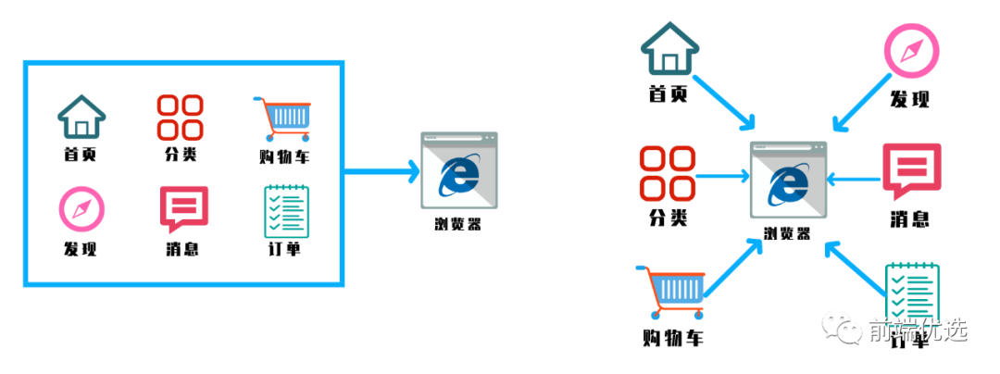
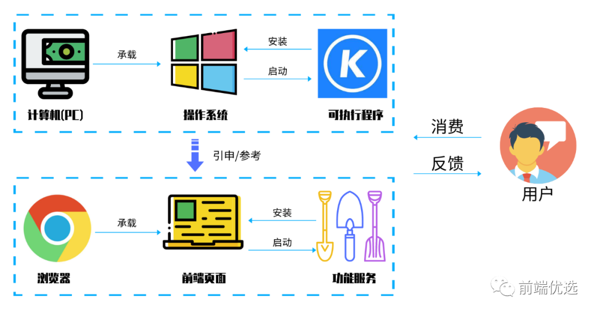

#一、为什么需要微前端?
##1.What?什么是微前端?

微前端就是将不同的功能按照不同的维度拆分成多个子应用。通过主应用来加载这些子应用

微前端的核心在于**拆**, 拆完后再**合**!

##2、why?为什么去使用他?
- 不同团队间开发同一个应用技术栈不同怎么破？
- 希望每个团队都可以独立开发，独立部署怎么破？
- 项目中还需要老的应用代码怎么破？

们是不是可以将一个应用划分成若干个子应用，再将子应用打包成一个个的lib呢？当路径切换时加载不同的子应用，这样每个子应用都是独立的，技术栈也就不用再做限制了！从而解决了前端协同开发的问题。

##3、How?怎样落地微前端?


Single-spa诞生于2018年，是一个用于前端微服务化的JavaScript前端解决方案  (本身没有处理样式隔离、js执行隔离)  实现了路由劫持和应用加载；
019年 qiankun基于Single-spa, 提供了更加开箱即用的 API  （single-spa + sandbox + import-html-entry），它 做到了技术栈无关，并且接入简单

>子应用可以独立构建，运行时动态加载，主子应用完全解耦，并且技术栈无关，靠的是协议接入（这里提前强调一下：子应用必须导出 bootstrap、mount、unmount三个方法）

###应用间如何通信？

- 基于URL来进行数据传递，但是这种传递消息的方式能力较弱；

- 基于CustomEvent实现通信；

- 基于props主子应用间通信；

- 使用全局变量、Redux进行通信。

###如何处理公共依赖？

- CDN - externals
- webpack联邦模块

#四、实战

# single-spa
## 1 创建两个项目并安装single-spa：


- son-spa-vue 

```
vue create son-spa-vue 
```

```
npm install single-spa-vue
```

- father-spa-vue

```
vue create father-spa-vue
```

```
npm install single-spa
```


2.子应用操作

App.vue文件
```app.vue文件

<template>
  <div id="app">
    <router-view/>
  </div>
</template>

<script>

export default {
  name: 'App',
  components: {
    
  }
}
</script>

<style>
#app {
  font-family: Avenir, Helvetica, Arial, sans-serif;
  -webkit-font-smoothing: antialiased;
  -moz-osx-font-smoothing: grayscale;
  text-align: center;
  color: #2c3e50;
  margin-top: 60px;
}
</style>

```


main.js

```
import Vue from 'vue'
import App from './App.vue'
import singlespaVue from 'single-spa-vue'
import router from './router'

Vue.config.productionTip = false

const appOptions = {
    el: '#vue',//挂载到父应用中的id为vue的标签中
    router,
    render: h => h(App)
}

//(子应用模式)vueLifeCycle(包装后的生命周期)对应这三个方法botstrap mount unmount
const vueLifeCycle = singlespaVue({
    Vue,
    appOptions
})

// （非子应用模式）在非子应用中正常挂载应用
if(!window.singleSpaNavigate){
    delete appOptions.el;
    new Vue(appOptions).$mount('#app');
}

//如果是父应用引用我
// if(window.singleSpaNavigate){
//     __webpack_public_path__ = 'http://localhost:10000/'
// }


//协议接入，子应用定义好协议，父应用调用这些方法
export const bootstrap = vueLifeCycle.bootstrap
export const mount = vueLifeCycle.mount
export const unmount = vueLifeCycle.unmount
export default vueLifeCycle;


```

3.将子应用打包成一个个的lib去给父应用使用

每个子应用根目录新建vue.config.js文件

```
// 配置将子应用打包成一个个的lib去给父应用使用

module.exports = {
    configureWebpack: {
        output: {
            library: 'singleVue',
            libraryTarget: 'umd'//umd模块作用，window.singleVue.bootstrap/mount/unmount，将这些挂在window上
        },
        devServer: {
            port: 10000
        }
    }
}
```

4. 路由

若安装无默认安装路由，需自己安装

- 安装

```
npm install vue-router  --save-dev 
```

- src 目录下 新建 router 目录，目录下新建 index.js
  
```
import Vue from 'vue'
import Router from 'vue-router'
import Home from '@/components/Home'

Vue.use(Router)


const routes =
[
{
path: '/',
name: 'Home',
component: Home

        }
    ]

const router = new Router({
mode: 'history',
base: '/vue',
routes
})


export default router 
  ```

  

- 在main.js中导入

```
import router from './router'
```


- 组件创建

  在components目录下新建组件

  ```
  <template>
    <div>
     <div>
       Home页面
     </div>
    </div>
  </template>
  
  <script>
  export default {
    name: 'Home',
    props: {
      msg: String
    }
  }
  </script>
  
  <!-- Add "scoped" attribute to limit CSS to this component only -->
  <style scoped>
  
  </style>
  
  ```

- 在router下的index.js文件中导入组件

```
import Home from '@/components/Home'
```

- 使用
  启动子应用
  启动父应用
  


